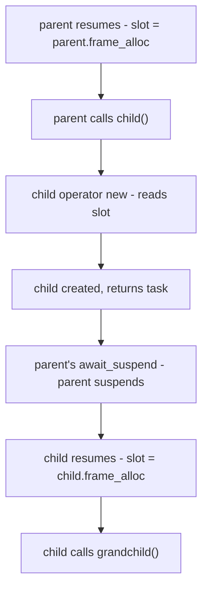

## Abstract

This paper documents the design rationale for the _IoAwaitable_ protocol.

[P4003R1](https://wg21.link/p4003r1) proposes the normative vocabulary (_IoAwaitable_, launch functions, executor shape). This paper is the companion record: why each facility exists, what alternatives were considered, how each choice was forced by the constraints of the domain, and where the historical evidence lives. Section 3 defines three audiences and their expected skill levels. Sections 4-7 present each protocol facility grouped by audience with expanded design rationale. Section 8 addresses frame allocator propagation. Section 9 demonstrates the ergonomic payoff. Sections 10-11 cover coexistence with `std::execution` and evidence. Appendix A provides async I/O background for committee members unfamiliar with the domain.

Read [P4003R1](https://wg21.link/p4003r1) first for specification text; read this paper when you need the design audit trail.

---

## Revision History

### R0: March 2026

* Initial draft.

---

## 1. Disclosure

The author provides information and serves at the pleasure of the committee.

This paper is part of the [Network Endeavor](https://wg21.link/p4100r0) ([P4100R0](https://wg21.link/p4100r0)<sup>[15]</sup>), a project to bring coroutine-native byte-oriented I/O to C++.

Falco and Gerbino developed and maintain [Capy](https://github.com/cppalliance/capy)<sup>[5]</sup> and [Corosio](https://github.com/cppalliance/corosio)<sup>[6]</sup> and believe coroutine-native I/O is the correct foundation for networking in C++.

Coroutine-native I/O and `std::execution` address different domains and should coexist in the C++ standard.

This paper asks for nothing.

---

## 2. Why Standardize

The [Network Endeavor](https://wg21.link/p4100r0) ([P4100R0](https://wg21.link/p4100r0)<sup>[15]</sup>) is a sequence of papers toward coroutine-native byte-oriented I/O in C++. [P4003R1](https://wg21.link/p4003r1) is the first increment that lands **normative vocabulary** in a proposal: _IoAwaitable_, _IoRunnable_, launch functions, `io_env`, type-erased _Executor_, and `execution_context`-shaped hosting. It is not a sockets, TLS, DNS, or buffer-sequence standard. Higher layers still need shared buffer and reactor choices; the standard does not promise them in the same breath. What it does promise is a **narrow waist**: agreement on how coroutine tasks start, suspend with environment in hand, cancel, and allocate frames so that libraries above the hook can interoperate.

Without that waist, every stack reinvents incompatible task types and environments; an HTTP layer on one model does not compose with storage or RPC on another. A small vocabulary is easier to ship and to revise than a monolithic networking API, and wrong vocabulary ossifies (allocator parameters threaded with `allocator_arg_t` through every public coroutine are difficult to undo once they ship; Section 8.1 demonstrates the signature pressure). The design in [P4003R1](https://wg21.link/p4003r1) favors out-of-band delivery of a frame `memory_resource` into `operator new` so application coroutines stay clean; Section 8.2 records the implementation choices and Section 8.4 records when other propagation shapes are appropriate.

**Performance** matters at that hook: [P4003R1](https://wg21.link/p4003r1) reports recycling frame allocators well ahead of `std::allocator` and ahead of mimalloc for microbenchmarks on the paper's workloads. The point is not a benchmark contest; it is that the standard should not force a slow default at the frame boundary.

The alternative of leaving coroutine I/O vocabulary to the ecosystem was considered. [Boost.Asio](https://www.boost.org/doc/libs/release/doc/html/boost_asio.html)<sup>[3]</sup> has been available for over twenty years. In that time, the C++ ecosystem has not produced a shared task type or environment protocol for async I/O. Each networking library builds on a different async model, so they cannot compose. The higher layers of the abstraction tower - HTTP frameworks, database drivers, RPC stacks that interoperate - have not emerged because the foundation is not shared. Twenty years of observed ecosystem behavior is sufficient to record that a shared vocabulary requires standardization.

Historic **whether-and-how** questions for committee networking priorities appear in [P0592R5](https://wg21.link/p0592r5)<sup>[9]</sup>, the 2021 LEWG polls [P2452R0](https://wg21.link/p2452r0)<sup>[10]</sup> / [P2453R0](https://wg21.link/p2453r0)<sup>[11]</sup>, and later SG4 and TAPS-oriented papers such as [P3185R0](https://wg21.link/p3185r0)<sup>[13]</sup> and [P3482R0](https://wg21.link/p3482r0)<sup>[14]</sup>. The historical arc from [N1925](https://wg21.link/n1925) through the Networking TS through executor unification through [P2300R10](https://wg21.link/p2300r10)<sup>[8]</sup> is traced in [P4099R0](https://wg21.link/p4099r0)<sup>[27]</sup>.

---

## 3. Audiences

The _IoAwaitable_ protocol serves three distinct audiences. Each has different skills, writes different code, and interacts with different facilities. The protocol is designed so that complexity concentrates where expertise exists and stays invisible where it does not.

Committee members unfamiliar with async I/O patterns may wish to read Appendix A first.

| Audience              | Population | Expected Skills                                                       | Facilities                                                                           |
| --------------------- | ---------- | --------------------------------------------------------------------- | ------------------------------------------------------------------------------------ |
| Application developer | Largest    | C++ fundamentals, `co_await` syntax, error handling                   | `co_await`, `run`, `run_async`, `io_env` (read-only), `std::stop_token` (check)     |
| Framework author      | Smallest   | Coroutine internals, promise types, type erasure, allocator mechanics | _IoRunnable_, `executor_ref`, `memory_resource`, `run_async`, `run`                  |
| I/O library author    | Moderate   | Platform APIs (epoll/IOCP/kqueue), reactor patterns, cancellation     | _IoAwaitable_, _Executor_, `continuation`, `std::stop_token`, `execution_context`    |

### 3.1 Application Developers

The largest population. They write business logic in coroutine bodies. They `co_await` both leaf awaitables and coroutine-backed types but implement neither:

```cpp
route_task serve_api(route_params& rp)
{
    auto result = co_await db.query("SELECT ...");
    auto json = serialize(result);
    auto [ec] = co_await rp.send(json);
    if (ec) co_return route_error(ec);
    co_return route_done;
}
```

*Expected skills:* C++ fundamentals. Basic understanding of `co_await` as "suspend until done." Error handling with `error_code`. Structured binding (`auto [ec, n] = ...`). They do not have to be experts in concurrency, lock-free programming, coroutine promise types, memory allocation strategy, or `await_transform`. They should not need to reason about which thread they are on.

*Design constraint:* If a facility requires this audience to understand anything beyond "call the function, check the error," the design has failed. Ergonomics is the primary filter. The protocol must be invisible to them - clean function signatures, automatic propagation of executor, stop token, and frame allocator. Every design decision in Sections 4-7 is evaluated against this constraint first.

### 3.2 Framework Authors

A small population of experts. They implement task types (`task<T>`, `route_task`, `generator<T>`) and launch functions. They write `promise_type` implementations, often inheriting `io_awaitable_promise_base` (Appendix C). They need to understand the full protocol: environment propagation, continuation mechanics, frame allocation timing, `await_transform`.

They write this code once per project. Many application developers consume it.

*Why multiple task types exist:* Different return policies (void vs value vs tuple), different cancellation behavior (ignore vs propagate vs transform), generators vs one-shot tasks, domain-specific error handling, custom `await_transform` for logging or instrumentation. [P4089R0](https://wg21.link/p4089r0)<sup>[28]</sup> documents how the Environment parameter in `std::execution::task<T, E>` creates cross-library interoperability problems when different libraries define different environments. The _IoAwaitable_ approach - one template parameter, environment propagated through `io_env` - avoids this structural barrier.

*Design constraint:* Complexity is acceptable here because the code is written once and consumed by many. But it must be tractable complexity - the `io_awaitable_promise_base` mixin (Appendix C) reduces the surface to policy decisions, not full protocol reimplementation.

### 3.3 I/O Library Authors

A moderate population. They implement the leaf awaitables: `socket.read_some()`, `timer.wait()`, `dns::resolve()`, `tls::handshake()`. These are custom structs satisfying _IoAwaitable_ - not coroutines. They are the leaves of the coroutine call chain: they submit operations to the OS and suspend.

*Expected skills:* Platform expertise - epoll, IOCP, kqueue, io_uring. Reactor patterns. OS-level cancellation primitives (`CancelIoEx`, `IORING_OP_ASYNC_CANCEL`, `close()`). They understand how to submit async operations and handle completions. They know the `await_ready`/`await_suspend`/`await_resume` contract. They use `continuation` + the executor for dispatch. They do not have to be experts in promise types, `await_transform`, frame allocation, or type erasure - those are framework concerns.

*Pattern:* The shape is consistent across all leaf awaitables. Construct the awaitable with operation parameters. In `await_suspend`, receive `io_env const*`, extract the executor and stop token, submit the operation to the reactor, return via `continuation` for symmetric transfer. In `await_resume`, return the result. They write many of these (one per I/O operation), but the pattern is repetitive once learned.

*Design constraint:* The two-argument `await_suspend(coroutine_handle<>, io_env const*)` is the critical interface for this audience. It must provide exactly what they need (executor for dispatch, stop token for cancellation) without exposing what they do not need (frame allocator internals, promise details).

### 3.4 Skill Boundaries

Each facility in Sections 4-7 is presented with its target audience. When a facility's complexity exceeds the expected skill level of its audience, that signals a design problem - either the facility needs simplification, or the audience classification is wrong. The sections that follow evaluate each facility against this constraint.

---

## 4. Protocol Basics

These facilities are encountered by every audience.

### 4.1 `co_await`

The motivating use case is a single line of code:

```cpp
auto [ec, n] = co_await socket.read_some(buf);
```

When this line executes, the coroutine suspends. Control passes to the awaitable returned by `read_some`, which holds the coroutine handle and submits the operation to the OS. When the OS completes the read, the reactor holds a coroutine handle and needs to wake the coroutine - but on which thread, under whose control?

The compiler transforms `co_await expr` into calls to three methods on the awaitable: `await_ready()` (can we skip suspension?), `await_suspend(handle)` (perform the suspension), and `await_resume()` (extract the result). The awaitable behind `socket.read_some(buf)` needs three things at the moment of suspension: who resumes it (executor), whether it should stop (stop token), and where child frames come from (frame allocator). These three concerns drive the entire protocol.

The _IoAwaitable_ protocol delivers them through the two-argument `await_suspend`:

```cpp
std::coroutine_handle<>
await_suspend(std::coroutine_handle<> h,
              io_env const* env);
```

The caller's `await_transform` injects `env` as the second parameter. The awaitable extracts what it needs. No templates, no type leakage into the caller.

### 4.2 `io_env`

The `io_env` struct bundles the three concerns from Section 4.1:

```cpp
struct io_env
{
    executor_ref executor;
    std::stop_token stop_token;
    std::pmr::memory_resource* frame_allocator
        = nullptr;
};
```

*Why three fields and no others.* The executor, stop token, and frame allocator are the minimum that every I/O awaitable needs at suspension time. Additional context (buffer pools, logging handles, tenant IDs) can travel through the execution context's service model (Section 5.5) or through application-specific channels. Adding fields to `io_env` would force every awaitable to carry context it does not use.

*Why pointer, not reference.* The launch function owns the `io_env`. Every coroutine in the chain borrows it. Pointer semantics make this ownership model explicit. Accidental copies are difficult. The lifetime invariant is structural: the `io_env` outlives every coroutine in the chain because the launch function that created it does not return until the chain completes.

*Why `const*`.* The environment is set at launch time and does not change during the chain's lifetime. `const` enforces this invariant. A coroutine that needs different environment parameters (a different executor, a different stop token) uses `run` (Section 7.2) to create a new `io_env` for a sub-chain.

---

## 5. I/O Operations

These facilities are used by I/O library authors to implement leaf awaitables.

### 5.1 _IoAwaitable_

```cpp
template<typename A>
concept IoAwaitable =
    requires(
        A a, std::coroutine_handle<> h,
        io_env const* env)
    {
        a.await_suspend(h, env);
    };
```

The two-argument `await_suspend` is the protocol boundary. The caller's `await_transform` injects the environment as a pointer parameter. A non-compliant awaitable produces a compile-time failure when a compliant coroutine's `await_transform` calls the two-argument form.

*Why not template on the promise type.* The standard C++20 pattern is `await_suspend(coroutine_handle<Promise>)`, where the awaitable sees the concrete promise type. This compiles silently when promise and awaitable are mismatched - a coroutine from one async model can `co_await` an awaitable from another, producing runtime errors instead of compile-time failures. The two-argument signature with `io_env const*` ensures that a coroutine from a different model (one whose `await_transform` does not inject `io_env`) fails to compile. Both sides of every suspension point are statically verified. [P4094R0](https://wg21.link/p4094r0)<sup>[22]</sup> Section 6 examines how rationale loss across paper boundaries contributed to the framing confusion between work and continuation semantics; a compile-time boundary prevents analogous confusion at the awaitable level.

*Trade-off:* The signature is non-standard; existing awaitables must be adapted. *Revisit if:* the language gains a mechanism for statically verifying awaitable-promise compatibility without a custom `await_suspend` signature.

### 5.2 _Executor_

An executor controls how coroutines resume. A minimal executor needs two operations:

```cpp
// Dispatch: may run inline (symmetric transfer)
std::coroutine_handle<>
dispatch(continuation& c) const;

// Post: always deferred
void post(continuation& c) const;
```

*Why two operations, not one.* `dispatch` runs the continuation inline when the caller is already in the executor's context. This is the common case after an I/O completion: the reactor thread detects the completion and dispatches the waiting coroutine with zero overhead via symmetric transfer. `post` always defers. The distinction matters for correctness: dispatching while holding a lock can deadlock if the continuation tries to acquire the same lock. `post` guarantees the continuation runs after the current function returns.

*Why `dispatch` returns `coroutine_handle<>`.* Symmetric transfer avoids stack buildup. Without it, a chain of N coroutines grows the call stack by N frames. [P2583](https://wg21.link/p2583)<sup>[29]</sup> provides the full analysis. `dispatch` returns `c.h` directly when inline execution is safe, or `noop_coroutine()` when it queues. The caller performs `return dispatch(c)` in its own `await_suspend`, and the compiler optimizes the tail call.

*Each concept requirement is load-bearing.* [P0443](https://wg21.link/p0443r14)<sup>[16]</sup> unified three executor models across 14 revisions; the unified design was never deployed. [P1738R0](https://wg21.link/p1738r0)<sup>[17]</sup> diagnosed the concept hierarchy as hostile to generic programming. [P1791R0](https://wg21.link/p1791r0)<sup>[19]</sup> recorded Rapperswil feedback: "these requirements are not universal." The _IoAwaitable_ executor concept has seven requirements. Removing any one produces a concrete failure:

- Nothrow copy/move: exception safety at suspension points
- `context()`: launch functions discover the default frame allocator
- `on_work_started`/`on_work_finished`: `ctx.run()` returns prematurely during `co_await run(worker_ex)(compute())` without them
- `dispatch` returning `coroutine_handle<>`: symmetric transfer
- `post`: always-defer resumption from foreign threads
- `operator==`: forward investment for strand support; `executor_ref` does not expose it

### 5.3 `continuation`

```cpp
struct continuation
{
    std::coroutine_handle<> h;
    continuation* next = nullptr;
};
```

The `continuation` struct pairs a `coroutine_handle<>` with an intrusive `next` pointer. Executors queue continuations without allocating a separate node - the continuation lives in the awaitable's frame or on the stack. This eliminates the last steady-state allocation in the hot path.

*Why not bare `coroutine_handle<>`.* A bare handle requires the executor to allocate a queue node to link it. With an intrusive pointer, the awaitable provides both the handle and the link. The cost is one pointer per awaitable. The benefit is zero allocation per dispatch.

### 5.4 `std::stop_token`

The stop token propagates forward through the coroutine chain from the launch site to the I/O object:

```
launch site -> handler -> sub-operation -> I/O object
```

The I/O object cancels the pending operation through the platform primitive: `CancelIoEx` on Windows, `IORING_OP_ASYNC_CANCEL` on Linux, `close()` on POSIX. The operation completes with an error and the coroutine chain unwinds normally.

*Why cooperative cancellation.* No operation is forcibly terminated. The I/O layer requests cancellation, the OS acknowledges it, and the operation completes with an error code. Resource cleanup is predictable. The coroutine always resumes - it handles cancellation via its normal error path. This differs from the sender model where `set_stopped` may cause `co_await` to never resume ([P4096R0](https://wg21.link/p4096r0)<sup>[24]</sup> Section 3-4).

*Historical context.* [P2175R0](https://wg21.link/p2175r0)<sup>[33]</sup> extended `std::stop_token` for sender/receiver with `stoppable_token` and receiver-based context propagation. [P3409R0](https://wg21.link/p3409r0)<sup>[34]</sup> found that allowing arbitrary stop-callback registration leads to intrusive lists and synchronization overhead (spin-mutex), motivating more constrained token shapes. The _IoAwaitable_ model uses `std::stop_token` directly with bounded, forward-only propagation, avoiding this cost.

### 5.5 `execution_context`

I/O objects need the platform reactor, not the executor. A socket registers with epoll, IOCP, or kqueue through the execution context, not through the executor. The executor is a lightweight handle; the context owns the reactor and its services.

```cpp
class execution_context
{
public:
    class service
    {
    public:
        virtual ~service() = default;
    protected:
        service() = default;
        virtual void shutdown() = 0;
    };

    template<class T> T& use_service();
    template<class T, class... Args>
        T& make_service(Args&&... args);

protected:
    void shutdown() noexcept;
    void destroy() noexcept;
};
```

*Why base class, not concept.* Services provide singletons with ordered shutdown. `shutdown()` walks services in reverse order of registration, preventing use-after-free in service dependencies. The service registry requires runtime polymorphism - a compile-time mechanism cannot provide the same ordered-shutdown guarantees when services are registered dynamically.

*Precedent.* The `execution_context` pattern originates in the Networking TS ([N4242](https://wg21.link/n4242)<sup>[35]</sup>, [N4575](https://wg21.link/n4575)<sup>[36]</sup>, [N4711](https://wg21.link/n4711)<sup>[37]</sup>) and has been stable across every revision. The service model, the shutdown ordering, and the `use_service`/`make_service` API have remained unchanged through over a decade of production use in Boost.Asio.

*Trade-off:* Virtual `shutdown()` in the service base class; runtime polymorphism in the service registry. *Revisit if:* a compile-time service mechanism can provide the same ordered-shutdown guarantees.

---

## 6. Task Types

These facilities are used by framework authors to implement coroutine-backed types (`task<T>`, `route_task`, etc.) and launch infrastructure.

### 6.1 _IoRunnable_

Within a coroutine chain, _IoAwaitable_ alone is sufficient - `co_await` handles lifetime, result extraction, and exception propagation natively. But launch functions like `run_async` cannot `co_await`. They need access to the promise to manage lifetime and extract results. _IoRunnable_ adds this interface:

```cpp
template<typename T>
concept IoRunnable =
    IoAwaitable<T> &&
    requires { typename T::promise_type; } &&
    requires(T& t, T const& ct,
             typename T::promise_type const& cp,
             typename T::promise_type& p)
    {
        { ct.handle() } noexcept
            -> std::same_as<
                std::coroutine_handle<
                    typename T::promise_type>>;
        { cp.exception() } noexcept
            -> std::same_as<std::exception_ptr>;
        { t.release() } noexcept;
        { p.set_continuation(
            std::coroutine_handle<>{}) } noexcept;
        { p.set_environment(
            static_cast<io_env const*>(
                nullptr)) } noexcept;
    };
```

*Why a separate concept.* Launch functions need `handle()` (to resume the coroutine), `exception()` (to rethrow), `release()` (to transfer ownership), `set_continuation()` (for symmetric transfer at completion), and `set_environment()` (to inject `io_env`). Leaf awaitables do not have these - they are plain structs, not coroutines. Conflating the two concepts would force leaf awaitables to carry promise machinery they do not need.

### 6.2 `executor_ref`

```cpp
class executor_ref
{
    void const* ex_ = nullptr;
    detail::executor_vtable const* vt_ = nullptr;

public:
    template<Executor E>
    executor_ref(E const& e) noexcept
        : ex_(&e)
        , vt_(&detail::vtable_for<E>) {}

    std::coroutine_handle<>
    dispatch(continuation& c) const;
    void post(continuation& c) const;
    execution_context& context() const noexcept;
};
```

The `executor_ref` type-erases any _Executor_ as two pointers. This is why `task<T>` needs only one template parameter.

*The type erasure trade-off.* C++20 coroutines allocate a frame for every invocation. The frame stores local variables, awaitables, and intermediate state across suspension points. For I/O coroutines, this allocation is unavoidable: Heap Allocation eLision Optimization (HALO) cannot apply when frame lifetime depends on an external event ([P2477R3](https://wg21.link/p2477r3)<sup>[31]</sup>). **The allocation we cannot avoid buys the type erasure we need.** The caller sees `task<Response>`. The coroutine body goes in a `.cpp` file; the header exposes the signature. Every type behind the frame boundary - sockets, SSL contexts, parsers - is hidden from the caller's type system. This is the foundation of ABI stability for coroutine-based libraries.

*Historical context.* [N4046](https://wg21.link/n4046)<sup>[21]</sup> argued that the compiler is unable to see through a virtual interface, and that forcing type erasure at the executor interface prevents implementers from choosing a better erasure. [P4099R0](https://wg21.link/p4099r0)<sup>[27]</sup> Section 5 documents the design fork: `coroutine_handle<>` in the awaitable trades type-erased streams, ABI stability, and separate compilation against full pipeline visibility and compile-time graphs. Boost.Asio and Boost.Beast made streams templates; the result was template explosion, binary bloat, and ABI instability across a decade of production use. The _IoAwaitable_ approach makes type erasure structural - the frame already pays for the allocation that makes erasure possible.

*Vtable cost.* One pointer indirection, roughly 1-2 nanoseconds, negligible for I/O operations at 10,000+ nanoseconds. *Revisit if:* the overhead proves measurable relative to I/O latency in a validated benchmark.

*One template parameter.* `task<T>` enables separate compilation and ABI stability. A coroutine returning `task<int>` can be defined in a `.cpp` file and called from any translation unit. [P4089R0](https://wg21.link/p4089r0)<sup>[28]</sup> documents how the second template parameter in `std::execution::task<T, E>` creates cross-library interoperability problems. [N5014](https://wg21.link/n5014)<sup>[38]</sup> defines `task<T, E>` with `Environment` customizing behavior - the direct "two-parameter task" that _IoAwaitable_ avoids.

### 6.3 `memory_resource`

A *frame allocator* is a `memory_resource` used exclusively for coroutine frame allocation. Coroutine frames follow a narrow pattern: sizes repeat, lifetimes nest, and deallocation order mirrors allocation order. A frame allocator exploits this pattern.

| Platform    | Frame Allocator  | Time (ms) | Speedup |
|-------------|------------------|----------:|--------:|
| MSVC        | Recycling        |   1265.2  |   3.10x |
| MSVC        | mimalloc         |   1622.2  |   2.42x |
| MSVC        | `std::allocator` |   3926.9  |       - |
| Apple clang | Recycling        |   2297.08 |   1.55x |
| Apple clang | `std::allocator` |   3565.49 |       - |

The mimalloc result is the critical comparison: a state-of-the-art general-purpose allocator with per-thread caches, yet the recycling frame allocator is 1.28x faster. Different deployments need different strategies - bounded pools, per-tenant budgets, allocation tracking - so the execution model must let the application choose.

*Historical context.* [P0054R0](https://wg21.link/p0054r0)<sup>[30]</sup> established `operator new` as the coroutine frame allocation hook. [P2006R0](https://wg21.link/p2006r0)<sup>[32]</sup> documented the "lifetime impedance mismatch" when adapting senders to awaitables - the adapter often adds a heap allocation due to inverted ownership. [P4095R0](https://wg21.link/p4095r0)<sup>[23]</sup> Section 4.3 demonstrated that the zero-allocation argument in [P1525R0](https://wg21.link/p1525r0)<sup>[20]</sup> applies to `execute(F&&)` type erasure, not to coroutine awaiters where the awaiter lives in the frame.

The frame allocator must be present at invocation time: `operator new` executes before the coroutine body. Section 8 documents the two delivery channels.

---

## 7. Application Surface

These facilities are what application developers interact with directly.

### 7.1 `run_async`

A regular function cannot `co_await` ([P4035R0](https://wg21.link/p4035r0)<sup>[39]</sup>). Every async program has exactly one place where synchronous code must launch the first coroutine:

```cpp
int main()
{
    io_context ctx;
    run_async(ctx.get_executor())(server_main());
    ctx.run();
}
```

The two-phase syntax - `run_async(ex)(my_task())` - exists because `operator new` executes before the coroutine body. The frame allocator must be set before `my_task()` is called. The first call (`run_async(ex)`) sets up the environment including the frame allocator. The second call (`(my_task())`) invokes the coroutine, whose `operator new` reads the frame allocator that is now in place. [P4127R0](https://wg21.link/p4127r0)<sup>[40]</sup> enumerates every C++20 coroutine customization point and proves the design space is closed: the parameter list and out-of-band state are the only two delivery channels.

Two-phase invocation was considered against single-call alternatives. The `operator new` timing constraint makes single-call impossible without language changes. The syntax is localized to launch sites. Application-level coroutines never see it.

Optional handlers make the launch structured:

```cpp
run_async(ex,
    [](int result) { /* use result */ },
    [](std::exception_ptr) { /* handle error */ }
)(compute());
```

Without handlers, the result is discarded and exceptions rethrow on the executor thread. This unstructured path is intentional - [P4035R0](https://wg21.link/p4035r0)<sup>[39]</sup> explains why the escape hatch must exist.

### 7.2 `run`

Within a coroutine chain, `run` switches executor, stop token, or allocator for a subtask:

```cpp
co_await run(worker_ex)(compute());

co_await run(source.get_token())(sensitive_op());

co_await run(pool)(alloc_heavy_op());

co_await run(worker_ex, source.get_token(), pool)(
    compute());
```

`run` cannot be detached. The parent suspends at `co_await` and resumes only when the child completes. The lexical boundary is enforced by the language. There is no unstructured path through `run`.

---

## 8. Frame Allocator Propagation

The frame allocator must reach `operator new` before the coroutine body executes. [P4127R0](https://wg21.link/p4127r0)<sup>[40]</sup> enumerates every C++20 coroutine customization point and proves the design space is closed: the parameter list and out-of-band state are the only two delivery channels. This section documents both, explains why both must exist, and details the out-of-band implementation choices.

### 8.1 The Parameter List (`allocator_arg_t`)

The first delivery channel. The allocator appears in the coroutine's parameter list. `promise_type::operator new` receives it as an argument:

```cpp
task<int> fetch_data(
    std::allocator_arg_t, MyAllocator alloc,
    socket& sock, buffer& buf) { ... }
```

This always works. It must always be available as a fallback because some environments lack out-of-band alternatives (no thread-local storage, no global state, freestanding). The parameter list is the explicit, visible, portable path.

The cost is signature pollution. Every coroutine in a call chain must carry the allocator. Consider a handler that calls two sub-coroutines:

```cpp
// IoAwaitable: the chain is clean
route_task handle_upload(route_params& rp)
{
    auto meta = co_await parse_metadata(rp);
    co_await store_file(meta, rp);
    auto [ec] = co_await rp.send("OK");
    if (ec) co_return route_error(ec);
    co_return route_done;
}
```

```cpp
// allocator_arg_t: every level carries the allocator
route_task handle_upload(
    std::allocator_arg_t, Alloc alloc,
    route_params& rp)
{
    auto meta = co_await parse_metadata(
        std::allocator_arg, alloc, rp);
    co_await store_file(
        std::allocator_arg, alloc, meta, rp);
    auto [ec] = co_await rp.send(
        std::allocator_arg, alloc, "OK");
    if (ec) co_return route_error(ec);
    co_return route_done;
}
```

Every `co_await` in the chain must forward the allocator. Containers in the standard library accept allocators because they are written once by experts and used many times. Coroutine handlers are the reverse: they are written by application developers, often in large numbers, for specific business logic. Burdening every handler with frame allocation plumbing is a significant ergonomic cost (Section 9 evaluates this against the audience skill model from Section 3).

Nothing in [P4003R1](https://wg21.link/p4003r1) forbids a codebase from choosing `allocator_arg_t` propagation end to end when explicit signatures are preferable.

### 8.2 Out-of-Band Propagation

The second delivery channel. The allocator is stored somewhere `operator new` can find it without appearing in the parameter list. The protocol specifies accessor functions but leaves the storage mechanism to the implementer:

```cpp
std::pmr::memory_resource*
get_current_frame_allocator() noexcept;

void
set_current_frame_allocator(
    std::pmr::memory_resource* mr) noexcept;
```

Multiple implementation choices exist:

- **Thread-local storage** - the default for hosted, multi-threaded environments. Written by `await_resume` on every coroutine resume, read by `operator new`. One pointer per thread.
- **A global variable** - sufficient for single-threaded or effectively serial runtimes where only one coroutine chain runs at a time. Simpler than TLS. Fails when multiple threads execute unrelated chains.
- **A data structure** (mutex-guarded map keyed by thread/fiber/context ID, or a field reached from the running executor) - for environments where TLS is banned or costly. Trades simplicity for generality.

The implementation chooses. The interface is two free functions, not a language feature.

### 8.3 The Execution Window and `safe_resume`

Out-of-band propagation relies on a narrow, deterministic execution window:

```cpp
task<void> parent()
{
    co_await child();
}
```

When `child()` is called: (1) `parent` is actively executing, (2) `child()`'s `operator new` is called, (3) `child()`'s frame is created, (4) `child()` returns task, (5) then `parent` suspends. The window is the period while the parent coroutine body executes.

Every time a coroutine resumes (after any `co_await`), it writes its frame allocator to the out-of-band slot via `await_resume`. When `child()` is called during that execution, `child`'s `operator new` sees the correct value:



**Intervening code and spoilage.** Between `await_resume` (which writes the slot) and `child()`'s `operator new` (which reads it), arbitrary user code may execute. If that code resumes a coroutine from a different chain, that coroutine's `await_resume` overwrites the slot. The consequence is not memory corruption - `operator delete` reads the allocator from a pointer embedded in the frame footer, not from the slot - but a frame may be allocated from the wrong resource.

The fix is `safe_resume`:

```cpp
inline void
safe_resume(std::coroutine_handle<> h) noexcept
{
    auto* saved = get_current_frame_allocator();
    h.resume();
    set_current_frame_allocator(saved);
}
```

Every executor event loop and strand dispatch loop saves the slot before resuming a coroutine handle and restores it after. The slot behaves like a stack. The cost is one pointer save and one pointer restore per `.resume()` call - negligible compared to the cost of resuming a coroutine. The burden falls on executor and strand authors (Section 5.2's audience), not application developers.

### 8.4 Concerns About Out-of-Band Propagation

**Hidden behavior.** The out-of-band slot is a write-through cache with exactly one purpose: deliver a `memory_resource*` to `operator new`. It is written before every coroutine invocation and read in exactly one place. The canonical value lives in `io_env`, heap-stable and owned by the launch function, repopulated on every resume. No algorithm inspects it. No behavior changes based on its contents. It controls where memory comes from, not what the program does. `std::pmr::get_default_resource()` is a standard-library precedent for a process-wide allocator channel adopted in C++17.

**Thread migration.** Every resume path - `initial_suspend`, every subsequent `co_await` via `await_transform` - unconditionally writes the frame allocator from `io_env` into the slot before the coroutine body continues. The write always precedes the read on the new thread. No suspended coroutine depends on the slot retaining a value across a suspension point. Deallocation is thread-independent: each frame stores its `memory_resource*` in a footer.

**Implicit propagation and lifetime.** Coroutine chains cannot outlive their launch site. The frame allocator outlives every frame that uses it - not by convention, but by the structural nesting of coroutine lifetimes.

---

## 9. Ergonomics

The executor, stop token, and frame allocator are infrastructure. They should be invisible to every coroutine except the launch site. When the developer needs control, the API should be obvious.

**Four requirements. One protocol.**

The audience model from Section 3 provides the evaluation lens. Application developers - the largest population - do not have to be concurrency experts. Every facility in Sections 4-7 was designed so that this audience writes clean business logic:

```cpp
route_task https_redirect(route_params& rp)
{
    std::string url = "https://";
    url += rp.req.at(field::host);
    url += rp.url.encoded_path();
    rp.status(status::found);
    rp.res.set(field::location, url);
    auto [ec] = co_await rp.send("redirect");
    if (ec)
        co_return route_error(ec);
    co_return route_done;
}
```

No executor parameter. No allocator parameter. No stop token parameter. The handler's parameter list describes the algorithm's interface and nothing else. The frame allocator propagates through the out-of-band channel (Section 8.2). The executor and stop token propagate through `io_env` (Section 4.2). The `await_transform` in the promise type injects them at every suspension point.

The `allocator_arg_t` alternative (Section 8.1) would require every handler to carry the allocator and forward it at every `co_await`. In a server with dozens of route handlers, each calling several sub-coroutines, every author of every handler would need to remember the forwarding at every call site. This exceeds the expected skill level of application developers (Section 3.1).

Type erasure through `executor_ref` (Section 6.2) keeps `task<T>` at one template parameter. This enables separate compilation and ABI stability. A coroutine returning `task<int>` can be defined in a `.cpp` file and called from any translation unit without exposing the executor type, the frame allocator, or the stop token in the public interface. Libraries built on _IoAwaitable_ ship as compiled binaries.

**One template parameter. Separate compilation. Stable ABI.**

---

## 10. Coexistence with `std::execution`

[P2300R10](https://wg21.link/p2300r10)<sup>[8]</sup> provides a uniform sender algebra, schedulers, customization points for heterogeneous backends, and structured concurrency building blocks. The _IoAwaitable_ vocabulary is not a replacement for `std::execution`. The two models address different domains, and C++ needs both.

Our evidence shows that the sender algebra is structurally suited to DAG-shaped work - GPU kernel fusion, heterogeneous compute pipelines, complex parallel algorithms - where sender composition, schedulers, and structured concurrency across heterogeneous resources are the essential operations. Byte-oriented I/O - sockets, DNS, TLS, HTTP - is sequential by nature for many handlers. A coroutine reads bytes, parses a frame, writes a response. The work is a chain, not a graph. _IoAwaitable_ captures this pattern with minimal machinery.

[P4094R0](https://wg21.link/p4094r0)<sup>[22]</sup> traces the executor unification arc from [P0443](https://wg21.link/p0443r14)<sup>[16]</sup> (14 revisions, never deployed as unified) through [P1525R0](https://wg21.link/p1525r0)<sup>[20]</sup> (Cologne 2019) to [P2300R10](https://wg21.link/p2300r10)<sup>[8]</sup>. [P4095R0](https://wg21.link/p4095r0)<sup>[23]</sup> demonstrates that under continuation framing, three of four deficiencies identified by [P1525R0](https://wg21.link/p1525r0)<sup>[20]</sup> do not arise. [P4096R0](https://wg21.link/p4096r0)<sup>[24]</sup> re-examines [P2464R0](https://wg21.link/p2464r0)<sup>[12]</sup> under the coroutine executor model. [P4097R0](https://wg21.link/p4097r0)<sup>[25]</sup> traces the evidence available at the time of the [P2453R0](https://wg21.link/p2453r0)<sup>[11]</sup> "including networking" poll. [P4098R0](https://wg21.link/p4098r0)<sup>[26]</sup> tabulates claims against published evidence across the entire executor and networking timeline.

**Bridges** make coexistence concrete. [P4092R0](https://wg21.link/p4092r0) specifies **`await_sender`**: consume a `std::execution` sender from inside an _IoAwaitable_ coroutine and return to the I/O executor. [P4093R0](https://wg21.link/p4093r0) specifies **`as_sender`**: wrap an _IoAwaitable_ as a sender for algorithms that speak sender/receiver.

```cpp
task<> handle_request(tcp_stream& stream)
{
    auto [ec, request] =
        co_await http::read(stream);
    if (ec)
        co_return;

    auto result = co_await await_sender(
        ex::on(gpu_sched,
            ex::then(
                ex::just(request.body()),
                classify_image)));

    http::response res(200);
    res.body() = serialize(result);
    co_await http::write(stream, res);
}
```

The I/O coroutine does not become a sender body. The GPU work remains a sender graph. Each model stays in the region where it is strongest.

---

## 11. Evidence and Accountability ([P4133R0](https://wg21.link/p4133r0))

[P4133R0](https://wg21.link/p4133r0) Section 3 lists topics for an implementation and experience paper. The protocol described in this paper was not designed top-down from theory. It was discovered bottom-up from working code, starting from an empty directory with nothing inherited and no existing framework assumed. Each facility was added when the next use case demanded it and not before. Every design decision recorded in this paper was forced by that process.

The protocol is recent. The patterns it captures are not. Type-erased executors, stop-token cancellation, and per-chain frame allocation have been refined across years of networking library development. The protocol is small because it was distilled from experience, not because it is incomplete.

### 11.1 Alternative and Complementary Designs

Four alternative approaches address the same problem space. Each is presented at its strongest.

**Sender/receiver ([P2300R10](https://wg21.link/p2300r10)<sup>[8]</sup>).** The committee-adopted framework for structured asynchronous execution. Its advantages are real: generality across I/O, GPU, and parallel workloads; a formal algebra of sender composition; strong structured-concurrency guarantees. For domains that require DAG-shaped execution graphs, sender/receiver provides machinery that _IoAwaitable_ does not attempt. Where sender/receiver is less well suited is in the I/O-specific properties: it requires a second template parameter on the task type, it does not define a frame allocator propagation mechanism, and the sender composition algebra adds conceptual weight that I/O coroutines do not use. [P4007R0](https://wg21.link/p4007r0)<sup>[1]</sup> and [P4014R0](https://wg21.link/p4014r0)<sup>[2]</sup> examine this relationship in detail.

**Boost.Asio completion handlers ([Boost.Asio](https://www.boost.org/doc/libs/release/doc/html/boost_asio.html)<sup>[3]</sup>).** The most widely deployed C++ async I/O model. Mature, extensively documented. Supports coroutines through completion tokens. The absence of a standard frame allocator propagation mechanism forces either `allocator_arg_t` signature pollution or reliance on `shared_ptr` for lifetime management.

**Pure coroutine libraries (cppcoro, libcoro).** Coroutine task types and synchronization primitives without a formal protocol. Simple, but each library defines its own model. Without a shared protocol, each library is an island.

**Do nothing.** Leave coroutine I/O execution models to the ecosystem. The advantage is zero standardization cost. The observed result after twenty years of Boost.Asio availability is documented in Section 2.

### 11.2 Decision Record

Each major design decision is documented with rationale, trade-offs, and conditions for revisiting.

**Two-argument `await_suspend(coroutine_handle<>, io_env const*)`** ([P4003R1](https://wg21.link/p4003r1) Section 4.1). The only signature that makes protocol violations a compile error. *Trade-off:* the signature is non-standard; existing awaitables must be adapted. *Revisit if:* the language gains a mechanism for statically verifying awaitable-promise compatibility.

**Out-of-band frame allocator propagation** (Section 8). Respects `operator new` timing without polluting application coroutine signatures. *Trade-off:* introduces a non-obvious propagation path. *Revisit if:* the language gains a mechanism to inject allocator context into `operator new` without function parameters.

**Type-erased `executor_ref`** ([P4003R1](https://wg21.link/p4003r1) Section 4.3). Keeps `task<T>` at one template parameter. *Trade-off:* type information is lost behind the erasure boundary. *Revisit if:* the overhead proves measurable relative to I/O latency.

**`io_env` passed by pointer** ([P4003R1](https://wg21.link/p4003r1) Section 4.1). Pointer semantics make ownership explicit. *Trade-off:* nullable pointer. *Revisit if:* a reference-based alternative can enforce the same ownership semantics.

**`execution_context` as a base class** ([P4003R1](https://wg21.link/p4003r1) Section 5.3). I/O objects bind to contexts, not executors. *Trade-off:* virtual `shutdown()`; runtime polymorphism. *Revisit if:* a compile-time service mechanism provides the same guarantees.

### 11.3 Domain Coverage

| Domain           | Implementation         | Platform coverage                 |
| ---------------- | ---------------------- | --------------------------------- |
| TCP/UDP sockets  | Corosio<sup>[6]</sup>  | Linux (epoll, io_uring), Windows (IOCP), macOS (kqueue) |
| TLS              | Corosio<sup>[6]</sup>  | All supported platforms via OpenSSL                      |
| DNS resolution   | Corosio<sup>[6]</sup>  | All supported platforms                                  |
| Timers           | Corosio<sup>[6]</sup>  | All supported platforms                                  |

[P4125R1](https://wg21.link/p4125r1)<sup>[41]</sup> reports a derivatives exchange porting from Asio callbacks to coroutine-native I/O using the _IoAwaitable_ protocol.

Domains not yet validated: embedded/real-time, file I/O, database I/O, game engines. GPU compute is a complementary domain addressed by `std::execution` (Section 10).

### 11.4 Post-Adoption Metrics

- At least two major standard library implementations ship a conforming implementation within two releases.
- At least three independently developed I/O libraries adopt the protocol within five years.
- At least one demonstrated case of two independent libraries composing through the protocol without glue code.
- The out-of-band frame allocator mechanism produces correct behavior on all three major platforms.

### 11.5 Retrospective Commitment

We commit to a retrospective at two standard releases or six years after standardization, whichever comes first.

### 11.6 Prediction Registry

| # | Prediction | Criterion | Revisit |
|---|---|---|---|
| 1 | The protocol is sufficient for all byte-oriented I/O domains | Implementation attempts in file I/O, database I/O, and IPC succeed without protocol extensions | +3 years |
| 2 | The out-of-band frame allocator achieves within 10% of benchmarked performance on all platforms | Benchmark comparison on libstdc++, libc++, MSVC STL | +2 releases |
| 3 | The two-call launch syntax does not become a barrier to adoption | Developer survey shows >60% find it acceptable or transparent | +3 years |
| 4 | The vtable overhead of `executor_ref` remains below 5% of total I/O operation cost | Microbenchmark on representative workloads across platforms | +2 releases |
| 5 | The single template parameter on `task<T>` remains sufficient | No widely adopted library requires a second template parameter | +5 years |
| 6 | At least three independent libraries adopt the protocol within five years | Count of libraries on vcpkg/Conan that declare _IoAwaitable_ conformance | +5 years |

---

## Appendix A: Understanding Asynchronous I/O

Not every committee member or library reviewer works with network programming daily, and the challenges that shape I/O library design may not be immediately obvious from other domains. This appendix provides the background needed to evaluate the design decisions in [P4003R1](https://wg21.link/p4003r1).

### A.1 The Problem with Waiting

Network I/O operates on a fundamentally different timescale than computation:

| Operation                | Approximate Time |
|--------------------------|------------------|
| CPU instruction          | 0.3 ns           |
| L1 cache access          | 1 ns             |
| Main memory access       | 100 ns           |
| Local network round-trip | 500 &mu;s        |
| Internet round-trip      | 50-200 ms        |

When code calls a blocking read on a socket, the thread waits while the network delivers data. During a 100ms network round-trip, a modern CPU could have executed 300 billion instructions.

### A.2 The Thread-Per-Connection Trap

The natural response to blocking I/O is to spawn a thread per connection. Each thread consumes memory (typically 1MB for the stack) and creates scheduling overhead. At 10,000 connections, the scheduler spends more time switching between threads than running actual code. The [C10K problem](http://www.kegel.com/c10k.html)<sup>[4]</sup> revealed that thread-per-connection does not scale.

### A.3 Event-Driven I/O

The solution is to invert the relationship between threads and I/O operations. The operating system provides mechanisms to wait for any of a set of file descriptors to become ready:

- **Linux**: `epoll` - register interest in file descriptors, wait for events
- **Windows**: I/O Completion Ports (IOCP) - queue-based completion notification
- **BSD/macOS**: `kqueue` - unified event notification

These mechanisms enable the proactor pattern: initiate an operation and receive notification when it finishes.

### A.4 Completion Handlers and Coroutines

Early asynchronous APIs used callbacks, producing "callback hell" that inverts control flow. C++20 coroutines restore sequential control flow while preserving the efficiency of asynchronous execution:

```cpp
task<> handle_connection(socket sock)
{
    char buf[1024];
    for (;;) {
        auto [ec, n] =
            co_await sock.read_some(buf);
        if (ec)
            co_return;
        co_await process_data(buf, n);
    }
}
```

### A.5 The Execution Context

I/O objects must be associated with an execution context that manages their lifecycle and delivers completions. A `socket` created with an `io_context` is registered with that context's platform reactor. This binding is physical - the socket's file descriptor is registered with specific kernel structures.

### A.6 Executors

An executor determines where and how work runs. `dispatch` runs work immediately if safe; `post` always defers. The distinction matters for correctness: dispatching while holding a mutex could deadlock.

### A.7 Strands: Serialization Without Locks

A strand guarantees that handlers submitted through it never execute concurrently, without using locks. Multiple strands can make progress concurrently on different threads, but within a single strand, execution is sequential.

### A.8 Cancellation

C++20's `std::stop_token` provides cooperative cancellation. The stop token propagates through the coroutine chain. At the lowest level, I/O objects observe the token and cancel pending operations with the appropriate OS primitive. Cancellation is cooperative - no operation is forcibly terminated.

### A.9 Moving Forward

With these fundamentals in hand - event loops, executors, strands, and cancellation - you have the conceptual vocabulary to understand the design decisions in the sections that precede this appendix. If you are eager to experiment, [Corosio](https://github.com/cppalliance/corosio)<sup>[6]</sup> implements these concepts in production-ready code.

---

## Appendix B: `any_read_stream`

This appendix provides the complete listing of `any_read_stream`, a type-erased wrapper for any type satisfying the `ReadStream` concept. It is not proposed for standardization - it is included to demonstrate what the _IoAwaitable_ protocol enables. The implementation is from the [Capy](https://github.com/cppalliance/capy)<sup>[5]</sup> library.

The vtable dispatches through the two-argument `await_suspend(coroutine_handle<>, io_env const*)`, preserving _IoAwaitable_ protocol compliance across the type erasure boundary. Awaitable storage is preallocated at construction time, so steady-state read operations involve zero allocation.

```cpp
class any_read_stream
{
    struct vtable;

    template<ReadStream S>
    struct vtable_for_impl;

    void* stream_ = nullptr;
    vtable const* vt_ = nullptr;
    void* cached_awaitable_ = nullptr;
    void* storage_ = nullptr;
    bool awaitable_active_ = false;

public:
    ~any_read_stream();

    any_read_stream() = default;
    any_read_stream(any_read_stream const&) = delete;
    any_read_stream& operator=(
        any_read_stream const&) = delete;

    any_read_stream(any_read_stream&& other) noexcept
        : stream_(std::exchange(
              other.stream_, nullptr))
        , vt_(std::exchange(other.vt_, nullptr))
        , cached_awaitable_(std::exchange(
              other.cached_awaitable_, nullptr))
        , storage_(std::exchange(
              other.storage_, nullptr))
        , awaitable_active_(std::exchange(
              other.awaitable_active_, false))
    {
    }

    any_read_stream&
    operator=(any_read_stream&& other) noexcept;

    template<ReadStream S>
        requires (!std::same_as<
            std::decay_t<S>, any_read_stream>)
    any_read_stream(S s);

    template<ReadStream S>
    any_read_stream(S* s);

    bool has_value() const noexcept
    {
        return stream_ != nullptr;
    }

    explicit operator bool() const noexcept
    {
        return has_value();
    }

    template<MutableBufferSequence MB>
    auto read_some(MB buffers);
};

struct any_read_stream::vtable
{
    void (*construct_awaitable)(
        void* stream, void* storage,
        std::span<mutable_buffer const> buffers);
    bool (*await_ready)(void*);
    std::coroutine_handle<> (*await_suspend)(
        void*, std::coroutine_handle<>,
        io_env const*);
    io_result<std::size_t> (*await_resume)(void*);
    void (*destroy_awaitable)(void*) noexcept;
    std::size_t awaitable_size;
    std::size_t awaitable_align;
    void (*destroy)(void*) noexcept;
};

template<ReadStream S>
struct any_read_stream::vtable_for_impl
{
    using Awaitable = decltype(
        std::declval<S&>().read_some(
            std::span<mutable_buffer const>{}));

    static void construct_awaitable_impl(
        void* stream, void* storage,
        std::span<mutable_buffer const> buffers)
    {
        auto& s = *static_cast<S*>(stream);
        ::new(storage)
            Awaitable(s.read_some(buffers));
    }

    static constexpr vtable value = {
        &construct_awaitable_impl,
        +[](void* p) {
            return static_cast<Awaitable*>(p)
                ->await_ready();
        },
        +[](void* p,
            std::coroutine_handle<> h,
            io_env const* env) {
            return static_cast<Awaitable*>(p)
                ->await_suspend(h, env);
        },
        +[](void* p) {
            return static_cast<Awaitable*>(p)
                ->await_resume();
        },
        +[](void* p) noexcept {
            static_cast<Awaitable*>(p)
                ->~Awaitable();
        },
        sizeof(Awaitable),
        alignof(Awaitable),
        +[](void* p) noexcept {
            static_cast<S*>(p)->~S();
        }
    };
};

template<MutableBufferSequence MB>
auto
any_read_stream::read_some(MB buffers)
{
    struct awaitable
    {
        any_read_stream* self_;
        mutable_buffer_array<max_iovec> ba_;

        bool await_ready()
        {
            self_->vt_->construct_awaitable(
                self_->stream_,
                self_->cached_awaitable_,
                ba_.to_span());
            self_->awaitable_active_ = true;
            return self_->vt_->await_ready(
                self_->cached_awaitable_);
        }

        std::coroutine_handle<>
        await_suspend(
            std::coroutine_handle<> h,
            io_env const* env)
        {
            return self_->vt_->await_suspend(
                self_->cached_awaitable_, h, env);
        }

        io_result<std::size_t>
        await_resume()
        {
            struct guard {
                any_read_stream* self;
                ~guard() {
                    self->vt_
                        ->destroy_awaitable(
                            self
                                ->cached_awaitable_);
                    self->awaitable_active_
                        = false;
                }
            } g{self_};
            return self_->vt_->await_resume(
                self_->cached_awaitable_);
        }
    };
    return awaitable{this,
        mutable_buffer_array<max_iovec>(buffers)};
}
```

---

## Appendix C: `io_awaitable_promise_base`

This mixin is not part of the protocol. It is a convenience for framework authors (Section 3.2) that encapsulates the boilerplate every _IoRunnable_-conforming promise type needs:

```cpp
template<typename Derived>
class io_awaitable_promise_base
{
    io_env const* env_ = nullptr;
    mutable std::coroutine_handle<> cont_{
        std::noop_coroutine()};

public:
    static void* operator new(std::size_t size)
    {
        auto* mr = get_current_frame_allocator();
        if (!mr)
            mr = std::pmr::new_delete_resource();
        auto total =
            size + sizeof(
                std::pmr::memory_resource*);
        void* raw = mr->allocate(
            total, alignof(std::max_align_t));
        std::memcpy(
            static_cast<char*>(raw) + size,
            &mr, sizeof(mr));
        return raw;
    }

    static void operator delete(
        void* ptr, std::size_t size) noexcept
    {
        std::pmr::memory_resource* mr;
        std::memcpy(
            &mr,
            static_cast<char*>(ptr) + size,
            sizeof(mr));
        auto total =
            size + sizeof(
                std::pmr::memory_resource*);
        mr->deallocate(
            ptr, total,
            alignof(std::max_align_t));
    }

    ~io_awaitable_promise_base()
    {
        if (cont_ != std::noop_coroutine())
            cont_.destroy();
    }

    void set_continuation(
        std::coroutine_handle<> cont) noexcept
    {
        cont_ = cont;
    }

    std::coroutine_handle<>
    continuation() const noexcept
    {
        return std::exchange(
            cont_, std::noop_coroutine());
    }

    void set_environment(
        io_env const* env) noexcept
    {
        env_ = env;
    }

    io_env const*
    environment() const noexcept
    {
        return env_;
    }

    template<typename A>
    decltype(auto)
    transform_awaitable(A&& a)
    {
        return std::forward<A>(a);
    }

    template<typename T>
    auto await_transform(T&& t)
    {
        using Tag = std::decay_t<T>;

        if constexpr (
            std::is_same_v<Tag, environment_tag>)
        {
            struct awaiter
            {
                io_env const* env_;
                bool await_ready() const noexcept
                    { return true; }
                void await_suspend(
                    std::coroutine_handle<>)
                    const noexcept {}
                io_env const* await_resume()
                    const noexcept
                    { return env_; }
            };
            return awaiter{env_};
        }
        else
        {
            return static_cast<Derived*>(this)
                ->transform_awaitable(
                    std::forward<T>(t));
        }
    }
};
```

Promise types inherit from this mixin to gain:

- **Frame allocation**: `operator new`/`delete` using the out-of-band frame allocator, with the `memory_resource*` stored at the end of each frame for correct deallocation
- **Continuation support**: `set_continuation`/`continuation` for unconditional symmetric transfer at `final_suspend`
- **Environment storage**: `set_environment`/`environment` for executor and stop token propagation
- **Awaitable transformation**: `await_transform` intercepts `environment_tag`, delegating all other awaitables to `transform_awaitable`

Derived promise types that need additional `await_transform` overloads should override `transform_awaitable` rather than `await_transform` itself. Defining `await_transform` in the derived class shadows the base class version, silently breaking `this_coro::environment` support. If a separate `await_transform` overload is truly necessary, import the base class overloads with a using-declaration:

```cpp
struct promise_type
    : io_awaitable_promise_base<promise_type>
{
    using io_awaitable_promise_base<
        promise_type>::await_transform;
    auto await_transform(my_custom_type&& t);
};
```

---

## Acknowledgements

The authors would like to thank Chris Kohlhoff for Boost.Asio and Lewis Baker for his foundational work on C++ coroutines - their contributions shaped the landscape upon which this paper builds. We also thank Peter Dimov and Mateusz Pusz for their valuable feedback, as well as Mohammad Nejati, Michael Vandeberg, and Klemens Morgenstern for their assistance with the implementation. The out-of-band propagation spoilage gap, which led to the `safe_resume` protocol described in Section 8.3, was identified during internal review.

---

## References

1. [P4007R0](https://wg21.link/p4007r0) - Senders and Coroutines (Vinnie Falco, Mungo Gill). https://wg21.link/p4007r0
2. [P4014R0](https://wg21.link/p4014r0) - The Sender Sub-Language (Vinnie Falco, Mungo Gill). https://wg21.link/p4014r0
3. [Boost.Asio](https://www.boost.org/doc/libs/release/doc/html/boost_asio.html) - Asynchronous I/O library (Chris Kohlhoff). https://www.boost.org/doc/libs/release/doc/html/boost_asio.html
4. [The C10K problem](http://www.kegel.com/c10k.html) - Scalable network programming (Dan Kegel). http://www.kegel.com/c10k.html
5. [Capy](https://github.com/cppalliance/capy) - _IoAwaitable_ protocol implementation (Vinnie Falco, Steve Gerbino). https://github.com/cppalliance/capy
6. [Corosio](https://github.com/cppalliance/corosio) - Coroutine-native I/O library (Vinnie Falco, Steve Gerbino). https://github.com/cppalliance/corosio
7. [Http](https://github.com/cppalliance/http) - HTTP library built on Capy (Vinnie Falco). https://github.com/cppalliance/http
8. [P2300R10](https://wg21.link/p2300r10) - "`std::execution`" (Dominiak, Baker, Howes, Shoop, Garland, Niebler, Lelbach, 2024). https://wg21.link/p2300r10
9. [P0592R5](https://wg21.link/p0592r5) - "To boldly suggest an overall plan for C++26" (Ville Voutilainen, 2022). https://wg21.link/p0592r5
10. [P2452R0](https://wg21.link/p2452r0) - "2021 October Library Evolution Polls on Networking and Executors" (Lelbach, Fracassi, Craig). https://wg21.link/p2452r0
11. [P2453R0](https://wg21.link/p2453r0) - "2021 October Library Evolution Poll Outcomes" (Lelbach, Fracassi, Craig, 2022). https://wg21.link/p2453r0
12. [P2464R0](https://wg21.link/p2464r0) - "Ruminations on networking and executors" (Ville Voutilainen, 2021). https://wg21.link/p2464r0
13. [P3185R0](https://wg21.link/p3185r0) - "A proposed direction for C++ Standard Networking based on IETF TAPS" (Thomas Rodgers, 2024). https://wg21.link/p3185r0
14. [P3482R0](https://wg21.link/p3482r0) - "Design for C++ networking based on IETF TAPS" (Thomas Rodgers, Dietmar K&uuml;hl, 2024). https://wg21.link/p3482r0
15. [P4100R0](https://wg21.link/p4100r0) - "The Network Endeavor: Coroutine-Native I/O for C++29" (Vinnie Falco et al., 2026). https://wg21.link/p4100r0
16. [P0443R14](https://wg21.link/p0443r14) - "A Unified Executors Proposal for C++" (Hoberock, Garland, Kohlhoff, et al., 2020). https://wg21.link/p0443r14
17. [P1738R0](https://wg21.link/p1738r0) - "The Executor Concept Hierarchy Needs a Single Root" (Eric Niebler, 2019). https://wg21.link/p1738r0
18. [P0688R0](https://wg21.link/p0688r0) - "Simplify the Unified Executors Design" (2017). https://wg21.link/p0688r0
19. [P1791R0](https://wg21.link/p1791r0) - "Evolution of P0443" (2019). https://wg21.link/p1791r0
20. [P1525R0](https://wg21.link/p1525r0) - "One-Way execute is a Poor Basis Operation" (Bryce Adelstein Lelbach, Lewis Baker, 2019). https://wg21.link/p1525r0
21. [N4046](https://wg21.link/n4046) - "Executors and Asynchronous Operations" (Chris Kohlhoff, 2014). https://wg21.link/n4046
22. [P4094R0](https://wg21.link/p4094r0) - "History: The Unification of Executors and P0443" (Vinnie Falco, 2026). https://wg21.link/p4094r0
23. [P4095R0](https://wg21.link/p4095r0) - "History: The Basis Operation and P1525" (Vinnie Falco, 2026). https://wg21.link/p4095r0
24. [P4096R0](https://wg21.link/p4096r0) - "History: Coroutine Executors and P2464R0" (Vinnie Falco, 2026). https://wg21.link/p4096r0
25. [P4097R0](https://wg21.link/p4097r0) - "History: The Networking Claim and P2453R0" (Vinnie Falco, 2026). https://wg21.link/p4097r0
26. [P4098R0](https://wg21.link/p4098r0) - "History: Async Claims and Evidence" (Vinnie Falco, 2026). https://wg21.link/p4098r0
27. [P4099R0](https://wg21.link/p4099r0) - "History: The Twenty-One Year Networking Arc" (Vinnie Falco, 2026). https://wg21.link/p4099r0
28. [P4089R0](https://wg21.link/p4089r0) - "Info: On the Diversity of Coroutine Task Types" (Vinnie Falco, 2026). https://wg21.link/p4089r0
29. [P2583](https://wg21.link/p2583) - "Symmetric Transfer" (Vinnie Falco). https://wg21.link/p2583
30. [P0054R0](https://wg21.link/p0054r0) - "Coroutines: reports from the fields" (Gor Nishanov, 2015). https://wg21.link/p0054r0
31. [P2477R3](https://wg21.link/p2477r3) - "Allow programmers to control coroutine elision" (Xu, 2022). https://wg21.link/p2477r3
32. [P2006R0](https://wg21.link/p2006r0) - "Eliminating heap-allocations in sender/receiver" (Baker, Niebler, Shoop, Howes, 2020). https://wg21.link/p2006r0
33. [P2175R0](https://wg21.link/p2175r0) - "Composable cancellation for sender/receiver" (Lewis Baker, 2020). https://wg21.link/p2175r0
34. [P3409R0](https://wg21.link/p3409r0) - "Stop token constraints" (Lewis Baker, 2024). https://wg21.link/p3409r0
35. [N4242](https://wg21.link/n4242) - "Executors and Asynchronous Operations, Revision 1" (Chris Kohlhoff, 2014). https://wg21.link/n4242
36. [N4575](https://wg21.link/n4575) - "Networking TS Working Draft" (2016). https://wg21.link/n4575
37. [N4711](https://wg21.link/n4711) - "Networking TS Working Draft" (2017). https://wg21.link/n4711
38. [N5014](https://wg21.link/n5014) - "Working Draft, Standard for Programming Language C++" (2025). https://wg21.link/n5014
39. [P4035R0](https://wg21.link/p4035r0) - "Support: The Need for Escape Hatches" (Vinnie Falco, 2026). https://wg21.link/p4035r0
40. [P4127R0](https://wg21.link/p4127r0) - "The Coroutine Frame Allocator Timing Problem" (Vinnie Falco, 2026). https://wg21.link/p4127r0
41. [P4125R1](https://wg21.link/p4125r1) - "Report: Coroutine-Native I/O at a Derivatives Exchange" (Mungo Gill, 2026). https://wg21.link/p4125r1
42. [P2469R0](https://wg21.link/p2469r0) - "Response to P2464" (Chris Kohlhoff et al., 2021). https://wg21.link/p2469r0
43. [P0703R0](https://wg21.link/p0703r0) - "Bloomberg's Perspective on the Networking TS" (David Sankel, 2017). https://wg21.link/p0703r0
44. [N4143](https://wg21.link/n4143) - "Executors and schedulers, revision 4" (Chris Mysen, 2014). https://wg21.link/n4143
45. [P0113R0](https://wg21.link/p0113r0) - "Executors and asynchronous operations" (Chris Kohlhoff, 2015). https://wg21.link/p0113r0
