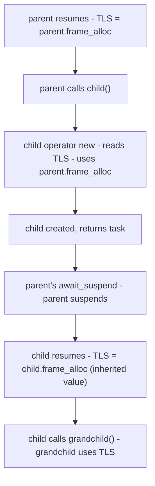

## Abstract

This documents the I/O Awaitable protocol.

[P4003R1](https://wg21.link/p4003r1) proposes the normative vocabulary (_IoAwaitable_, launch functions, executor shape). This paper is the companion record: why that slice is the right **narrow waist**, what was rejected, how frame allocation and TLS interact with `operator new`, how type erasure stays at one template parameter, and where the evidence lives. **Section 10** answers objections in advance. **Section 11** aligns implementation and accountability material with [P4133R0](https://wg21.link/p4133r0). Read P4003R1 first for specification text; read this paper when you need the design audit trail.

---

## Revision History

### R0: March 2026

* Initial draft.

---

## 1. Disclosure

The author provides information and serves at the pleasure of the committee.

This paper is part of the [Network Endeavor](https://wg21.link/p4100r0) ([P4100R0](https://wg21.link/p4100r0)), a project to bring coroutine-native byte-oriented I/O to C++.

Falco and Gerbino developed and maintain [Capy](https://github.com/cppalliance/capy)<sup>[5]</sup> and [Corosio](https://github.com/cppalliance/corosio)<sup>[6]</sup> and believe coroutine-native I/O is the correct foundation for networking in C++.

Coroutine-native I/O and `std::execution` address different domains and should coexist in the C++ standard.

This paper asks for nothing.

---

## 2. Why Standardize

The [Network Endeavor](https://wg21.link/p4100r0) ([P4100R0](https://wg21.link/p4100r0)) is a sequence of papers toward coroutine-native byte-oriented I/O in C++. [P4003R1](https://wg21.link/p4003r1) is the first increment that lands **normative vocabulary** in a proposal: _IoAwaitable_, _IoRunnable_, launch functions, `io_env`, type-erased _Executor_, and `execution_context`-shaped hosting. It is not a sockets, TLS, DNS, or buffer-sequence standard. Higher layers still need shared buffer and reactor choices; the standard does not promise them in the same breath. What it does promise is a **narrow waist**: agreement on how coroutine tasks start, suspend with environment in hand, cancel, and allocate frames so that libraries above the hook can interoperate.

Without that waist, every stack reinvents incompatible task types and environments; an HTTP layer on one model does not compose with storage or RPC on another. A small vocabulary is easier to ship and to revise than a monolithic networking API, and wrong vocabulary ossifies (allocator parameters threaded with `allocator_arg_t` through every public coroutine are difficult to undo once they ship; Section 5 demonstrates the signature pressure). The design in P4003R1 favors **thread-local** delivery of a **frame** `memory_resource` into `operator new` so application coroutines stay clean; Section 7.4 records when other propagation shapes are appropriate.

**Performance** matters at that hook: [P4003R1](https://wg21.link/p4003r1) reports recycling frame allocators well ahead of `std::allocator` and ahead of mimalloc for microbenchmarks on the paper's workloads. The point is not a benchmark contest; it is that the standard should not force a slow default at the frame boundary.

Historic **whether-and-how** questions for committee networking priorities appear in [P0592R5](https://wg21.link/p0592r5)<sup>[9]</sup>, the 2021 LEWG polls [P2452R0](https://wg21.link/p2452r0)<sup>[10]</sup> / [P2453R0](https://wg21.link/p2453r0)<sup>[11]</sup>, and later SG4 and TAPS-oriented papers such as [P3185R0](https://wg21.link/p3185r0)<sup>[13]</sup> and [P3482R0](https://wg21.link/p3482r0)<sup>[14]</sup>. This section does not reproduce that timeline. It states why **this** increment is worth recording: bounded committee surface, disproportionate enablement for byte-stream coroutine code, and an honest scope line between vocabulary and full stack.

---

## 3. What the vocabulary is (and is not)

A byte-stream read has **a small number of implementations per platform**: the coroutine suspends, the host reactor completes the operation, the executor resumes the coroutine under application policy. That pattern is not unique to TCP; it is the shape of cursor/stream I/O that _IoAwaitable_ names.

The protocol defines the contract in terms of four cooperating pieces: **Executor** (how work is queued and resumed: `dispatch` vs `post`, symmetric transfer); **Stop token** (cooperative cancellation from launch site to I/O object); **Frame allocator** (which `memory_resource` backs `promise_type::operator new` for the chain); **Execution context** (where the reactor and services live; I/O objects bind to it). Normative definitions are in [P4003R1](https://wg21.link/p4003r1); this section orients the reader.

### 3.1 The Executor

An allocator controls where objects live. An executor controls how coroutines resume. A minimal executor needs two operations: `dispatch` for continuations that can run inline, and `post` for work that must be deferred. The distinction matters for correctness: inline execution while holding a lock can deadlock. `dispatch` uses symmetric transfer to avoid stack buildup. [P4003R1](https://wg21.link/p4003r1) Section 5 defines the concept and its semantics.

### 3.2 The `stop_token`

The stop token propagates forward through the coroutine chain from the launch site to the I/O object:

```
http_client -> http_request -> write -> write_some -> socket
```

The I/O object cancels the pending operation through the platform primitive: `CancelIoEx` on Windows, `IORING_OP_ASYNC_CANCEL` on Linux, `close()` on POSIX. The operation completes with an error and the coroutine chain unwinds normally. Cancellation is cooperative.

### 3.3 The Frame Allocator

A *frame allocator* is a `memory_resource` used exclusively for coroutine frame allocation. Coroutine frames follow a narrow pattern: sizes repeat, lifetimes nest, and deallocation order mirrors allocation order. A frame allocator exploits this pattern.

Every `co_await` may spawn new frames. Recycling frame allocators cache recently freed frames for immediate reuse:

| Platform    | Frame Allocator  | Time (ms) | Speedup |
|-------------|------------------|----------:|--------:|
| MSVC        | Recycling        |   1265.2  |   3.10x |
| MSVC        | mimalloc         |   1622.2  |   2.42x |
| MSVC        | `std::allocator` |   3926.9  |       - |
| Apple clang | Recycling        |   2297.08 |   1.55x |
| Apple clang | `std::allocator` |   3565.49 |       - |

The mimalloc result is the critical comparison: a state-of-the-art general-purpose allocator with per-thread caches, yet the recycling frame allocator is 1.28x faster. Different deployments need different strategies - bounded pools, per-tenant budgets, allocation tracking - so the execution model must let the application choose. The frame allocator must be present at invocation time: `operator new` executes before the coroutine body. [P4003R1](https://wg21.link/p4003r1) Section 6 examines the timing constraint and the solution.

### 3.4 Ergonomics

The executor, stop token, and frame allocator are infrastructure. They should be invisible to every coroutine except the launch site. When the developer needs control, the API should be obvious.

**Four requirements. One protocol.**

---

## 4. Coexistence with `std::execution`

**Read the grain of sender/receiver.** [P2300R10](https://wg21.link/p2300r10)<sup>[8]</sup> provides a uniform sender algebra, schedulers, customization points for heterogeneous backends, and structured concurrency building blocks that shipped in teaching and library practice. **Where it is a weaker match for this paper's domain:** byte-stream I/O tasks want one surfaced template parameter on the task (`task<T>`), a first-class frame-allocator story at `operator new` time, and sequential coroutine ergonomics without composing every hop as a sender expression.

The _IoAwaitable_ vocabulary is **not** a replacement for `std::execution`. The two models address different domains, and C++ needs both.

Byte-oriented I/O - sockets, DNS, TLS, HTTP - is sequential by nature for many handlers. A coroutine reads bytes, parses a frame, writes a response. The work is a chain, not a graph. _IoAwaitable_ captures this pattern with minimal machinery: two concepts, one type-erased executor, and a frame-allocator channel into `operator new` (Section 7).

GPU dispatch, heterogeneous compute, and parallel algorithms are different. Work is submitted in DAG-shaped graphs. Kernel fusion, multi-device scheduling, and compile-time pipeline composition are the essential operations. `std::execution` provides the algebra for this domain - sender composition, schedulers, and structured concurrency across heterogeneous resources. An I/O coroutine does not need that algebra for every line of parsing. A GPU pipeline does not need frame allocator propagation at the same boundary.

**Bridges** make coexistence concrete. [P4092R0](https://wg21.link/p4092r0) specifies **`await_sender`**: consume a `std::execution` sender from inside an _IoAwaitable_ coroutine and return to the I/O executor. [P4093R0](https://wg21.link/p4093r0) specifies **`as_sender`**: wrap an _IoAwaitable_ as a sender for algorithms that speak sender/receiver. Shapes, environment queries, and compound-result limits are in those papers.

Coexistence is desirable in the same program. The sketch below is illustrative; names follow the bridge papers.

```cpp
task<> handle_request(tcp_stream& stream)
{
    auto [ec, request] = co_await http::read(stream);
    if (ec)
        co_return;

    auto result = co_await await_sender(
        ex::on(gpu_sched,
            ex::then(
                ex::just(request.body()),
                classify_image)));

    http::response res(200);
    res.body() = serialize(result);
    co_await http::write(stream, res);
}
```

The I/O coroutine does not become a sender body. The GPU work remains a sender graph. Each model stays in the region where it is strongest.

---

## 5. The Frame Allocator: Why Not `allocator_arg_t`

C++ provides exactly one hook at the right time: **`promise_type::operator new`**. The compiler passes coroutine arguments directly to this overload, allowing the promise to inspect parameters and select a frame allocator. The standard pattern uses `std::allocator_arg_t` as a tag to mark the allocator parameter:

```cpp
// Free function: frame allocator intrudes on the parameter list
task<int> fetch_data( std::allocator_arg_t, MyAllocator alloc,
                      socket& sock, buffer& buf ) { ... }

// Member function: same intrusion
task<void> Connection::process( std::allocator_arg_t, MyAllocator alloc,
                                request const& req) { ... }
```

The promise type must provide multiple `operator new` overloads to handle both cases:

```cpp
struct promise_type {
    // For free functions
    template< typename Alloc, typename... Args >
    static void* operator new( std::size_t sz,
        std::allocator_arg_t, Alloc& a, Args&&...) {
        return a.allocate(sz);
    }

    // For member functions (this is first arg)
    template< typename T, typename Alloc, typename... Args >
    static void* operator new( std::size_t sz,
        T&, std::allocator_arg_t, Alloc& a, Args&&...) {
        return a.allocate(sz);
    }
};
```

This approach works, but it violates encapsulation. The coroutine's parameter list - which should describe the algorithm's interface - is polluted with frame allocation machinery unrelated to its purpose. A function that fetches data from a socket should not need to know or care about memory policy. Worse, every coroutine in a call chain must thread the frame allocator through its signature, even if it never uses it directly. The frame allocator becomes viral, infecting interfaces throughout the codebase.

To make this concrete, consider a real HTTP route handler as written with _IoAwaitable_:

```cpp
// IoAwaitable: clean interface describes only the algorithm
route_task https_redirect(route_params& rp)
{
    std::string url = "https://";
    url += rp.req.at(field::host);
    url += rp.url.encoded_path();
    rp.status(status::found);
    rp.res.set(field::location, url);
    auto [ec] = co_await rp.send("redirect");
    if (ec)
        co_return route_error(ec);
    co_return route_done;
}
```

Now consider the same handler under the `allocator_arg_t` approach. The frame allocator must appear in the parameter list, and every coroutine the handler calls must also accept it:

```cpp
// allocator_arg_t: allocation machinery intrudes on every signature
route_task https_redirect(std::allocator_arg_t, Alloc alloc,
                          route_params& rp)
{
    std::string url = "https://";
    url += rp.req.at(field::host);
    url += rp.url.encoded_path();
    rp.status(status::found);
    rp.res.set(field::location, url);
    auto [ec] = co_await rp.send(std::allocator_arg, alloc, "redirect");
    if (ec)
        co_return route_error(ec);
    co_return route_done;
}
```

The handler's *purpose* is identical. The frame allocator adds nothing to its logic - it is a cross-cutting concern being threaded through the interface. The pollution compounds through a call chain. Consider a handler that calls two sub-coroutines:

```cpp
// IoAwaitable: the chain is clean
route_task handle_upload(route_params& rp)
{
    auto meta = co_await parse_metadata(rp);
    co_await store_file(meta, rp);
    auto [ec] = co_await rp.send("OK");
    if (ec) co_return route_error(ec);
    co_return route_done;
}
```

```cpp
// allocator_arg_t: every level in the chain carries the frame allocator
route_task handle_upload(std::allocator_arg_t, Alloc alloc,
                         route_params& rp)
{
    auto meta = co_await parse_metadata(std::allocator_arg, alloc, rp);
    co_await store_file(std::allocator_arg, alloc, meta, rp);
    auto [ec] = co_await rp.send(std::allocator_arg, alloc, "OK");
    if (ec) co_return route_error(ec);
    co_return route_done;
}
```

Every `co_await` in the chain must forward the frame allocator. Every function in the chain must accept it. `parse_metadata` and `store_file` must thread it through to their own sub-coroutines, and so on down. In a real server with dozens of route handlers, each calling several sub-coroutines, every author of every handler must remember to pass the frame allocator at every call site. This is the opposite of ergonomic.

Containers in the standard library accept allocators because they are written once by experts and used many times. Coroutine handlers are the reverse: they are written by application developers, often in large numbers, for specific business logic. Burdening every handler with frame allocation plumbing is a significant ergonomic cost.

Nothing in P4003R1 forbids a codebase from choosing **`allocator_arg_t` propagation end to end** when explicit signatures are preferable to TLS. You pay visibility and call-site forwarding; you gain allocation policy that is obvious in every stack frame. Section 7.4 discusses hosts where TLS is unavailable, avoided, or insufficient alone.

---

## 6. The Frame Allocator: The Window and `safe_resume`

Thread-local propagation relies on a narrow, deterministic execution window. Consider:

```cpp
task<void> parent() {        // parent is RUNNING here
    co_await child();        // child() called while parent is running
}
```

When `child()` is called:
1. `parent` coroutine is **actively executing** (not suspended)
2. `child()`'s `operator new` is called
3. `child()`'s frame is created
4. `child()` returns task
5. THEN `parent` suspends

The window is the period while the parent coroutine body executes. If `parent` sets TLS when it resumes and `child()` is called during that execution, `child`'s `operator new` sees the correct TLS value.

TLS remains valid between `await_suspend` and `await_resume`:

```cpp
auto initial_suspend() noexcept {
    struct awaiter {
        promise_type* p_;
        bool await_ready() const noexcept { return false; }
        void await_suspend(std::coroutine_handle<>) const noexcept {
            // Capture TLS frame allocator while it is still valid
            p_->set_frame_allocator( get_current_frame_allocator() );
        }
        void await_resume() const noexcept {
            // Restore TLS when body starts executing
            if( p_->frame_allocator() )
                set_current_frame_allocator( p_->frame_allocator() );
        }
    };
    return awaiter{this};
}
```

Every time the coroutine resumes (after any `co_await`), it sets TLS to its frame allocator. When `child()` is called, TLS is already pointing to `parent`'s frame allocator. The flow:



This is safe because:

- TLS is only read in `operator new` - no other code path inspects the thread-local frame allocator
- TLS is written by the currently-running coroutine before any child is created, and restored from the heap-stable `io_env` on every resume via `await_resume`. Executor event loops preserve this invariant by saving and restoring TLS around each `.resume()` call (see "Intervening Code and TLS Spoilage" below)
- Thread migration is handled: when a coroutine suspends on thread A and resumes on thread B, the `await_resume` path writes the correct frame allocator into thread B's TLS before the coroutine body continues. TLS is never *read* on a thread unless the coroutine that wrote it is actively executing on that thread
- No dangling: the coroutine that set TLS is still on the call stack when `operator new` reads it
- Deallocation is thread-independent: `operator delete` reads the frame allocator from a pointer embedded in the frame footer, not from TLS. A frame can be destroyed on any thread

### 6.1 Intervening Code and TLS Spoilage

The analysis above covers the direct case: `co_await child()` is the first expression after resume. Consider instead:

```cpp
task<void> parent()
{
    foo();
    co_await child();
}
```

Between `await_resume` (which sets TLS) and `child()`'s `operator new` (which reads TLS), `foo()` executes. If `foo()` resumes a coroutine from a different chain on this thread - by pumping a dispatch queue, running nested event loop work, or calling `.resume()` on a foreign handle - that coroutine's `await_resume` overwrites TLS with its own frame allocator. When `foo()` returns and `child()` is called, `operator new` reads the wrong value.

The consequence is not memory corruption. `operator delete` reads the frame allocator from the frame footer, not from TLS. A frame allocated from the wrong resource is deallocated from the correct one. The program produces correct results with the wrong allocation strategy for some frames. But a user who passes a `monotonic_buffer_resource` to `run_async` expects every frame in that chain to use it. Silent allocation from a different resource violates that expectation.

The fix is a save/restore protocol at every `.resume()` call site:

```cpp
inline void
safe_resume(std::coroutine_handle<> h) noexcept
{
    auto* saved = get_current_frame_allocator();
    h.resume();
    set_current_frame_allocator(saved);
}
```

Every executor event loop and strand dispatch loop saves TLS before resuming a coroutine handle and restores it after the coroutine suspends and `.resume()` returns. TLS now behaves like a stack: each nested resume pushes a frame allocator; when `.resume()` returns, the previous value is restored. The cost is one pointer save and one pointer restore per `.resume()` call - two TLS accesses, negligible compared to the cost of resuming a coroutine.

Two `.resume()` sites intentionally do not use `safe_resume`:

1. **Symmetric transfer workarounds.** When a coroutine calls `.resume()` as a substitute for symmetric transfer (to work around compiler codegen bugs), the calling coroutine is about to suspend unconditionally. When it later resumes, `await_resume` restores TLS from the promise's stored environment. Save/restore here would add overhead on every suspension with no benefit.

2. **Launch function wrappers.** `run_async`'s internal wrapper saves TLS in its constructor and restores it in its destructor, bracketing the entire task lifetime. The `.resume()` inside the wrapper occurs within this bracket.

The burden falls on executor and strand authors - the same people who write promise types, `await_transform`, and `operator new` overloads. They write `safe_resume` once, and every application developer who writes a coroutine body benefits without knowing it exists.

---

## 7. The Frame Allocator: Addressing TLS Concerns

Thread-local storage has a well-deserved reputation for creating hidden coupling and brittle behavior. The concerns are familiar and worth addressing directly.

### 7.1 Concern: Hidden Behavior

TLS has earned its bad name: a global variable by another name. Functions behave differently depending on who called them last. The objection is sound in the general case.

This is not the general case. The thread-local here is a **write-through cache** with exactly one purpose: deliver a `memory_resource*` to `operator new`. It is written before every coroutine invocation - by `await_resume` from the coroutine side, and preserved by `safe_resume` from the event loop side - and read in exactly one place. The canonical value lives in `io_env`, heap-stable and owned by the launch function, repopulated on every resume. No algorithm inspects it. No behavior changes based on its contents. It controls where memory comes from, not what the program does.

The reason TLS is involved at all is `operator new`'s fixed signature. The frame allocator cannot arrive as a parameter without polluting every coroutine signature with `allocator_arg_t` (Section 5). The standard library already accepted this tradeoff: `std::pmr::get_default_resource()` is a process-wide thread-local allocator channel, adopted in C++17. Ours is the same principle, scoped per-chain instead of per-process.

### 7.2 Concern: Thread Migration

Thread migration is the obvious objection: suspend on thread A, resume on thread B, read stale TLS. The invariant that prevents this is simple: **TLS is never read on a thread unless the coroutine that wrote it is actively executing on that same thread.**

Every resume path - `initial_suspend`, every subsequent `co_await` via `await_transform` - unconditionally writes the frame allocator from `io_env` into TLS *before* the coroutine body continues:

```cpp
void await_resume() const noexcept
{
    // Restore TLS from heap-stable io_env
    set_current_frame_allocator(p_->io_env_->frame_allocator);
}
```

The write always precedes the read on the new thread. No suspended coroutine depends on TLS retaining a value across a suspension point.

Deallocation is thread-independent. Each frame stores its `memory_resource*` in a footer. `operator delete` reads from the footer, not from TLS. A frame allocated on thread A can be destroyed on thread C.

### 7.3 Concern: Implicit Propagation and Lifetime

Coroutine chains differ structurally from containers. A container can outlive its creator. A coroutine chain cannot outlive its launch site. The frame allocator outlives every frame that uses it - not by convention, but by the structural nesting of coroutine lifetimes.

The _IoAwaitable_ model performs the lookup before the frame is created - the one point in time where it can actually work. Any mechanism that delivers the allocator after coroutine invocation arrives too late by definition.

**Performance requires the frame allocator; ergonomics require TLS. Both or neither.**

### 7.4 Other propagation channels and allocator shapes

**Thread-local is the default story in this paper because** it keeps application coroutine signatures clean while satisfying `operator new` timing. It is not the only implementation strategy.

**Single-threaded or effectively serial runtimes.** When only one coroutine chain runs at a time, a process-wide or launch-scoped `std::pmr::memory_resource*` (for example a pointer written once before invoking the root task) can substitute for TLS: `operator new` reads that slot. The approach fails when multiple threads execute unrelated chains without isolating the slot.

**TLS rejected or unavailable.** Some teams ban thread-local storage; some hosted environments make it costly. An implementation can keep the active `memory_resource*` in a **mutex-guarded map** keyed by thread id, fiber id, or an explicit execution-context token, or store it in a field reached from the running executor. Correctness trades for lock contention and author discipline.

**What the hook ultimately consumes.** [P4003R1](https://wg21.link/p4003r1) centers **`std::pmr::memory_resource*`** in `io_env` because it is a stable type-erased boundary across TUs. Alternatives in the wild include **templated allocator types** threaded with `allocator_arg_t` (often fastest when the concrete allocator is fixed; viral at ABI boundaries) and **custom type-erased handles** when PMR indirection is too much but templates are too loud. The narrow waist of the proposal is the protocol surface; the concrete storage type behind `operator new` remains a design choice so long as frames allocate and deallocate symmetrically and child frames see the intended resource.

---

## 8. The Ergonomics of Type Erasure

C++20 coroutines allocate a frame for every invocation. The frame stores local variables, awaitables, and intermediate state across suspension points. For I/O coroutines, this allocation is unavoidable: Heap Allocation eLision Optimization (HALO) cannot apply when frame lifetime depends on an external event.

**The allocation we cannot avoid buys the type erasure we need.**

### 8.1 Coroutine Frames as Type Erasure

A socket, an SSL context, an HTTP parser, a database connection - all live inside a coroutine frame. The caller sees `task<Response>`. The coroutine body goes in a `.cpp` file; the header exposes the signature. Every type behind the frame boundary is hidden from the caller's type system. This is the foundation of ABI stability for coroutine-based libraries.

### 8.2 Type-Erased Streams

This research produced `any_read_stream`, a type-erased wrapper for any type satisfying the `ReadStream` concept (complete listing in Appendix B). It is not part of the _IoAwaitable_ protocol, but it demonstrates what the protocol enables: zero-steady-state-allocation type erasure for I/O, with cached awaitable storage and a vtable that dispatches through the two-argument `await_suspend`.

[Http](https://github.com/cppalliance/http)<sup>[7]</sup>, an HTTP library built on Capy, works entirely in terms of type-erased streams. It reads requests, parses headers, dispatches to route handlers, and sends responses without knowing whether the underlying transport is a TCP socket, a TLS connection, or a test harness. The HTTP library depends on Capy's type-erased abstractions. It ships as a compiled library with stable ABI.

### 8.3 One Template Parameter

The _IoAwaitable_ protocol type-erases the environment through `executor_ref` and `std::pmr::memory_resource*`. The task type has one template parameter:

```cpp
template<class T> class task;
```

This enables separate compilation and ABI stability. A coroutine returning `task<int>` can be defined in a `.cpp` file and called from any translation unit without exposing the executor type, the frame allocator, or the stop token in the public interface. Libraries built on _IoAwaitable_ ship as compiled binaries. [P4007R0](https://wg21.link/p4007r0)<sup>[1]</sup> Section 6.4 examines why alternative designs require a second template parameter and what the ecosystem's response has been.

### 8.4 Ergonomic Impact

An HTTP server has dozens of route handlers. A database layer has query functions. A WebSocket handler has message processors. Application developers write these, not framework experts.

With _IoAwaitable_, the executor, frame allocator, and stop token propagate automatically. The developer writes business logic:

```cpp
route_task serve_api( route_params& rp )
{
    auto result = co_await db.query("SELECT ...");
    auto json = serialize(result);
    auto [ec] = co_await rp.send(json);
    if (ec) co_return route_error(ec);
    co_return route_done;
}
```

**One template parameter. Separate compilation. Stable ABI.**

---

## 9. The `io_awaitable_promise_base` Mixin

This utility simplifies promise type implementation by providing the internal machinery that every _IoRunnable_-conforming promise type needs:

```cpp
template<typename Derived>
class io_awaitable_promise_base
{
    io_env const* env_ = nullptr;
    mutable std::coroutine_handle<> cont_{
        std::noop_coroutine()};

public:
    // Frame allocation using thread-local frame allocator.
    // Stores the memory_resource* at the end of each
    // frame so deallocation is correct even when TLS
    // has changed.

    static void* operator new(std::size_t size)
    {
        auto* mr = get_current_frame_allocator();
        if (!mr)
            mr = std::pmr::new_delete_resource();
        auto total =
            size + sizeof(std::pmr::memory_resource*);
        void* raw = mr->allocate(
            total, alignof(std::max_align_t));
        std::memcpy(
            static_cast<char*>(raw) + size,
            &mr, sizeof(mr));
        return raw;
    }

    static void operator delete(
        void* ptr, std::size_t size) noexcept
    {
        std::pmr::memory_resource* mr;
        std::memcpy(
            &mr, static_cast<char*>(ptr) + size,
            sizeof(mr));
        auto total =
            size + sizeof(std::pmr::memory_resource*);
        mr->deallocate(
            ptr, total,
            alignof(std::max_align_t));
    }

    ~io_awaitable_promise_base()
    {
        // Abnormal teardown: destroy orphaned continuation
        if (cont_ != std::noop_coroutine())
            cont_.destroy();
    }

    // Continuation for symmetric transfer at final_suspend

    void set_continuation(
        std::coroutine_handle<> cont) noexcept
    {
        cont_ = cont;
    }

    std::coroutine_handle<>
    continuation() const noexcept
    {
        return std::exchange(
            cont_, std::noop_coroutine());
    }

    // Environment storage

    void set_environment(
        io_env const* env) noexcept
    {
        env_ = env;
    }

    io_env const* environment() const noexcept
    {
        return env_;
    }

    // Default pass-through; derived classes override
    // to add custom awaitable transformation.

    template<typename A>
    decltype(auto) transform_awaitable(A&& a)
    {
        return std::forward<A>(a);
    }

    // Intercepts this_coro tags, delegates the rest
    // to transform_awaitable.

    template<typename T>
    auto await_transform(T&& t)
    {
        using Tag = std::decay_t<T>;

        if constexpr (
            std::is_same_v<Tag, environment_tag>)
        {
            struct awaiter
            {
                io_env const* env_;
                bool await_ready() const noexcept
                    { return true; }
                void await_suspend(
                    std::coroutine_handle<>)
                    const noexcept {}
                io_env const* await_resume()
                    const noexcept { return env_; }
            };
            return awaiter{env_};
        }
        else
        {
            return static_cast<Derived*>(this)
                ->transform_awaitable(
                    std::forward<T>(t));
        }
    }
};
```

Promise types inherit from this mixin to gain:

- **Frame allocation**: `operator new`/`delete` using the thread-local frame allocator, with the frame allocator pointer stored via `memcpy` at the end of each frame for correct deallocation. Bypasses virtual dispatch for the recycling frame allocator
- **Continuation support**: `set_continuation`/`continuation` for unconditional symmetric transfer at `final_suspend`
- **Environment storage**: `set_environment`/`environment` for executor and stop token propagation
- **Awaitable transformation**: `await_transform` intercepts `environment_tag`, delegating all other awaitables to `transform_awaitable`

The `await_transform` method uses `if constexpr` to dispatch tag types to immediate awaiters (where `await_ready()` returns `true`), enabling `co_await this_coro::environment` without suspension. Other awaitables pass through to `transform_awaitable`, which derived classes can override to add custom transformation logic.

> **Non-normative note.** Derived promise types that need additional `await_transform` overloads should override `transform_awaitable` rather than `await_transform` itself. Defining `await_transform` in the derived class shadows the base class version, silently breaking `this_coro::environment` support. If a separate `await_transform` overload is truly necessary, import the base class overloads with a using-declaration:
>
> ```cpp
> struct promise_type : io_awaitable_promise_base<promise_type>
> {
>     using io_awaitable_promise_base<promise_type>::await_transform;
>     auto await_transform(my_custom_type&& t); // additional overload
> };
> ```

This mixin encapsulates the boilerplate that every _IoRunnable_-compatible promise type would otherwise duplicate.

---

## 10. Preemptive Objections

Every foreseeable objection deserves a direct response in its strongest form.

### "The ecosystem can deliver this without standardization"

It has not. [Boost.Asio](https://www.boost.org/doc/libs/release/doc/html/boost_asio.html)<sup>[3]</sup> has been available for over twenty years. In that time, the C++ ecosystem has not produced the tower of abstractions that every other major language ecosystem enjoys. There is no Django of C++. There is no standard HTTP framework. The `vcpkg` and Conan catalogs do not approach the depth of npm or pip for networking applications. The reason is that every C++ networking library is an island - each builds on a different async model, so they cannot compose. The ecosystem cannot converge on a common vocabulary without standardization, because the entire point of a vocabulary is that everyone can depend on it being there. Twenty years of evidence is sufficient to conclude that the ecosystem alone will not produce a shared foundation.

### "Thread-local storage is problematic"

Section 7 addresses the TLS concerns directly. The thread-local here is a write-through cache with exactly one purpose: deliver a `memory_resource*` to `operator new`. It is written before every coroutine invocation and read in exactly one place. Thread migration is handled: every resume path restores TLS from the heap-stable `io_env` before the coroutine body continues. The standard library already accepted this approach: `std::pmr::get_default_resource()` is a process-wide thread-local allocator channel, adopted in C++17. For platforms without thread-local storage, implementations may use whatever mechanism is available - the interface is two free functions, not a language feature.

### "The two-call syntax is a workaround"

It is. The syntax exists because `operator new` executes before the coroutine body, and no mechanism exists to inject the frame allocator after invocation. A future language change could eliminate the need. But the alternative - threading `allocator_arg_t` through every coroutine signature in every library across the ecosystem - is worse, and that damage would be permanent if standardized. The two-call syntax is localized to launch sites. Application-level coroutines never see it.

### "The design is too young"

The protocol is young. The patterns it captures are not. Type-erased executors, stop-token cancellation, and per-chain frame allocation have been refined across years of networking library development. The protocol is small because it was distilled from experience, not because it is incomplete. What matters is whether the protocol is correct - and three deployed libraries across multiple platforms provide that evidence.

**The ecosystem has had twenty years. The tower does not exist.**

---

## 11. Evidence and accountability ([P4133R0](https://wg21.link/p4133r0))

[P4133R0](https://wg21.link/p4133r0) Section 3 lists topics for an implementation and experience paper. Subsections **11.A** gather present-tense evidence; **11.B** gathers forward-looking commitments.

### 11.A Pre-ship and present-tense material

The protocol described in this paper was not designed top-down from theory. It was discovered bottom-up from working code. We started from an empty directory - an empty `.cpp` file, an empty `.hpp` file - with nothing inherited and no existing framework assumed. We added one thing at a time: a coroutine, then an executor, then a stop token, then a frame allocator. At each step we added exactly what the next use case demanded and nothing more. The result is the smallest abstraction from which nothing can be removed and still remain functional. Every design decision recorded below was forced by this process - not chosen from a menu of options but discovered as the only thing that worked. The evidence is the code itself.

### 11.1 Alternative and Complementary Designs

Four alternative approaches address the same problem space. Each has genuine advantages. We present each at its strongest before explaining why _IoAwaitable_ is preferred for byte-oriented I/O.

**Sender/receiver ([P2300R10](https://wg21.link/p2300r10)<sup>[8]</sup>).** The committee-adopted framework for structured asynchronous execution. Its advantages are real: generality across I/O, GPU, and parallel workloads; a formal algebra of sender composition; strong structured-concurrency guarantees; and significant investment from NVIDIA, Meta, and Bloomberg. For domains that require DAG-shaped execution graphs - GPU kernel fusion, heterogeneous compute pipelines, complex parallel algorithms - sender/receiver provides machinery that _IoAwaitable_ does not attempt, and `std::execution` is the right model for those domains. The two frameworks are complementary: _IoAwaitable_ handles byte-oriented I/O while `std::execution` handles heterogeneous and parallel compute (Section 4). Where sender/receiver is less well suited is in the I/O-specific properties that drive this paper: it requires a second template parameter on the task type (making separate compilation and ABI stability difficult), it does not define a frame allocator propagation mechanism, and the sender composition algebra adds conceptual weight that I/O coroutines - which are sequential by nature - do not use. [P4007R0](https://wg21.link/p4007r0)<sup>[1]</sup> and [P4014R0](https://wg21.link/p4014r0)<sup>[2]</sup> examine this relationship in detail.

**Boost.Asio completion handlers ([Boost.Asio](https://www.boost.org/doc/libs/release/doc/html/boost_asio.html)<sup>[3]</sup>).** The most widely deployed C++ async I/O model, with over twenty years of production use. Its advantages are maturity, extensive documentation, and a large existing codebase. It supports coroutines through completion tokens. The 2021 LEWG polls<sup>[10]</sup> found weak consensus against the Networking TS async model as a general-purpose basis (5 SF, 10 WF, 6 N, 14 WA, 18 SA), primarily due to concerns about composability, error handling between work submission and continuation invocation<sup>[12]</sup>, and unsuitability for GPU workloads. For I/O specifically, the Asio model remains capable, but the completion-token mechanism requires each call site to specify how it will be consumed, and the absence of a standard frame allocator propagation mechanism forces either `allocator_arg_t` signature pollution or reliance on `shared_ptr` for lifetime management.

**Pure coroutine libraries (cppcoro, libcoro).** These provide coroutine task types and synchronization primitives without a formal protocol. Their advantage is simplicity - a task type, a scheduler, and nothing else. The limitation is that each library defines its own model. An HTTP library built on cppcoro cannot compose with a database driver built on libcoro. Without a shared protocol, each library is an island.

**Do nothing.** Leave coroutine I/O execution models to the ecosystem. The advantage is zero standardization cost and maximum freedom for library authors. The disadvantage is twenty years of evidence: [Boost.Asio](https://www.boost.org/doc/libs/release/doc/html/boost_asio.html)<sup>[3]</sup> has been available since 2003. In that time, the ecosystem has not produced a standard HTTP framework, a standard WebSocket library, or a web application framework comparable to what other language ecosystems provide. Each C++ networking library builds on a different async model. The higher layers of the abstraction tower - the layers that application developers need - have not emerged because the foundation is not shared.

### 11.2 Decision Record

Each major design decision was forced by the bottom-up development process described above. This section consolidates the rationale, documents trade-offs, and states conditions for revisiting.

**Two-argument `await_suspend(coroutine_handle<>, io_env const*)`** ([P4003R1](https://wg21.link/p4003r1) Section 4.1). The only signature that makes protocol violations a compile error. A non-compliant awaitable produces a compile-time failure when a compliant coroutine's `await_transform` calls the two-argument form. The alternative - templating on the promise type - compiles silently when mismatched and produces runtime errors. *Trade-off:* the signature is non-standard; existing awaitables must be adapted. *Revisit if:* the language gains a mechanism for statically verifying awaitable-promise compatibility without a custom `await_suspend` signature.

**Thread-local frame allocator propagation** (Sections 5-7). The primary mechanism in P4003R1 that respects `operator new` timing without polluting application coroutine signatures with `allocator_arg_t` (Section 7.4 for alternates). The frame allocator must be available before the coroutine frame exists. Standard approaches (parameter threading, post-construction injection) arrive too late. *Trade-off:* relies on thread-local storage; introduces a non-obvious propagation path. *Revisit if:* the language gains a mechanism to inject allocator context into `operator new` without function parameters.

**Type-erased `executor_ref`** ([P4003R1](https://wg21.link/p4003r1) Section 4.3). The only way to keep `task<T>` at one template parameter. Alternatives that preserve the executor type in the task type produce `task<T, Executor>`, which prevents separate compilation and ABI stability. The vtable cost is one pointer indirection - roughly 1-2 nanoseconds - negligible for I/O operations. *Trade-off:* type information is lost behind the erasure boundary. *Revisit if:* the overhead proves measurable relative to I/O latency in a validated benchmark.

**`io_env` passed by pointer** ([P4003R1](https://wg21.link/p4003r1) Section 4.1). The launch function owns the `io_env`. Every coroutine in the chain borrows it. Pointer semantics make this ownership model explicit and make accidental copies difficult. *Trade-off:* nullable pointer; requires documentation of lifetime invariant. *Revisit if:* a reference-based alternative can enforce the same ownership semantics without adding a nullable state.

**`execution_context` as a base class** ([P4003R1](https://wg21.link/p4003r1) Section 5.3). I/O objects need the platform reactor, not the executor. A socket registers with epoll, IOCP, or kqueue through the execution context, not through the executor. The executor is a lightweight handle; the context owns the reactor and its services. *Trade-off:* virtual `shutdown()` in the service base class; runtime polymorphism in the service registry. *Revisit if:* a compile-time service mechanism can provide the same ordered-shutdown guarantees.

### 11.3 Domain Coverage

The _IoAwaitable_ protocol has been validated in the following I/O domains through deployed implementations:

| Domain           | Implementation         | Platform coverage                 |
| ---------------- | ---------------------- | --------------------------------- |
| TCP/UDP sockets  | Corosio<sup>[6]</sup>  | Linux (epoll, io_uring), Windows (IOCP), macOS (kqueue) |
| TLS              | Corosio<sup>[6]</sup>  | All supported platforms via OpenSSL                      |
| DNS resolution   | Corosio<sup>[6]</sup>  | All supported platforms                                  |
| HTTP/1.1         | Http<sup>[7]</sup>     | All supported platforms                                  |
| Timers           | Corosio<sup>[6]</sup>  | All supported platforms                                  |

Domains not yet validated:

- **Embedded/real-time** - thread-local storage may be unavailable or expensive; bounded-memory frame allocators need testing
- **File I/O** - completion patterns differ from socket I/O; the protocol should apply but has not been demonstrated
- **Database I/O** - query-response patterns differ from byte-stream I/O
- **Game engines** - custom job systems with different scheduling constraints
- **GPU compute** - a complementary domain addressed by `std::execution`; see Section 4 and [P4007R0](https://wg21.link/p4007r0)<sup>[1]</sup>

### 11.B Forward-looking commitments

### 11.4 Post-Adoption Metrics

The following measurable criteria define successful adoption:

1. **Implementation breadth.** At least two major standard library implementations (libstdc++, libc++, or MSVC STL) ship a conforming _IoAwaitable_ implementation within two releases of the standard that adopts it.
2. **Library adoption.** At least three independently developed I/O libraries adopt the _IoAwaitable_ protocol within five years of standardization.
3. **Interoperability.** At least one demonstrated case of two independently developed libraries (e.g., an HTTP library and a database driver) composing through the protocol without glue code.
4. **Frame allocator robustness.** The thread-local frame allocator mechanism produces correct behavior on all three major platforms without platform-specific workarounds.
5. **Developer comprehension.** Developer surveys or conference feedback show that the two-call launch syntax and the TLS propagation mechanism are understood by a majority of C++ developers who use coroutines for I/O.

### 11.5 Retrospective Commitment

We commit to a retrospective at two standard releases or six years after standardization, whichever comes first. The retrospective must answer:

1. Did major implementations ship? If not, what blocked them?
2. Did independent libraries adopt the protocol? If not, what prevented interoperability?
3. Did the thread-local frame allocator mechanism prove robust across platforms?
4. Did the two-call launch syntax prove acceptable to users, or did workarounds proliferate?
5. Did the single template parameter on `task<T>` remain sufficient as the ecosystem grew?
6. Did the vtable overhead of `executor_ref` remain negligible relative to I/O latency?
7. What design limitations emerged in practice that were not anticipated?

### 11.6 Prediction Registry

| # | Prediction                                                                                       | Criterion                                                                                      | Revisit     |
|---|--------------------------------------------------------------------------------------------------|------------------------------------------------------------------------------------------------|-------------|
| 1 | The _IoAwaitable_ protocol is sufficient for all byte-oriented I/O domains                       | Implementation attempts in file I/O, database I/O, and IPC succeed without protocol extensions | +3 years    |
| 2 | The thread-local frame allocator achieves within 10% of benchmarked performance on all platforms  | Benchmark comparison on libstdc++, libc++, MSVC STL                                            | +2 releases |
| 3 | The two-call launch syntax does not become a barrier to adoption                                  | Developer survey shows >60% find it acceptable or transparent                                  | +3 years    |
| 4 | The vtable overhead of `executor_ref` remains below 5% of total I/O operation cost               | Microbenchmark on representative workloads across platforms                                    | +2 releases |
| 5 | The single template parameter on `task<T>` remains sufficient for the ecosystem                   | No widely adopted library requires a second template parameter for environment or executor type | +5 years    |
| 6 | At least three independent libraries adopt the protocol within five years                         | Count of libraries on vcpkg/Conan that declare _IoAwaitable_ conformance                      | +5 years    |

---

## Appendix A: Understanding Asynchronous I/O

Not every committee member or library reviewer works with network programming daily, and the challenges that shape I/O library design may not be immediately obvious from other domains. This appendix provides the background needed to evaluate the design decisions in [P4003R1](https://wg21.link/p4003r1). The concepts presented here draw heavily from Christopher Kohlhoff's pioneering work on Boost.Asio, which has served the C++ community for over two decades, and from Gor Nishanov's C++ coroutines that now enable elegant expression of asynchronous control flow.

### A.1 The Problem with Waiting

Network I/O operates on a fundamentally different timescale than computation. A CPU executes billions of instructions per second; reading a single byte from a local network takes microseconds, and from a remote server, milliseconds. The disparity is stark:

| Operation                | Approximate Time |
|--------------------------|------------------|
| CPU instruction          | 0.3 ns           |
| L1 cache access          | 1 ns             |
| Main memory access       | 100 ns           |
| Local network round-trip | 500 &mu;s        |
| Internet round-trip      | 50-200 ms        |

When code calls a blocking read on a socket, the thread waits - doing nothing - while the network delivers data. During a 100ms network round-trip, a modern CPU could have executed 300 billion instructions. Blocking I/O wastes this potential.

```cpp
// Blocking I/O: thread waits here
char buf[1024];
ssize_t n = recv(fd, buf, sizeof(buf), 0);  // Thread blocked
process(buf, n);
```

For a single connection, this inefficiency is tolerable. For a server handling thousands of connections, it becomes catastrophic.

### A.2 The Thread-Per-Connection Trap

The natural response to blocking I/O is to spawn a thread per connection. Each thread blocks on its own socket; while one waits, others make progress.

```cpp
void handle_client(socket client) {
    char buf[1024];
    while (true) {
        auto [ec, n] = client.read_some(buf);
        if (ec) break;
        process(buf, n);
    }
}

// Spawn a thread for each connection
for (;;) {
    socket client = accept(listener);
    std::thread(handle_client, std::move(client)).detach();
}
```

This works - until it does not. Each thread consumes memory (typically 1MB for the stack) and creates scheduling overhead. Context switches between threads cost thousands of CPU cycles. At 10,000 connections, you have 10,000 threads consuming 10GB of stack space, and the scheduler spends more time switching between threads than running actual code.

The [C10K problem](http://www.kegel.com/c10k.html)<sup>[4]</sup> - handling 10,000 concurrent connections - revealed that thread-per-connection does not scale. Modern servers handle millions of connections. Something else is needed.

### A.3 Event-Driven I/O

The solution is to invert the relationship between threads and I/O operations. Instead of one thread per connection, use a small number of threads that multiplex across many connections. The operating system provides mechanisms to wait for *any* of a set of file descriptors to become ready:

- **Linux**: `epoll`  - register interest in file descriptors, wait for events
- **Windows**: I/O Completion Ports (IOCP)  - queue-based completion notification
- **BSD/macOS**: `kqueue`  - unified event notification

These mechanisms enable the **proactor pattern**: instead of blocking until an operation completes, you *initiate* an operation and receive notification when it finishes. The thread is free to do other work in the meantime.

```cpp
io_context ioc;
socket sock(ioc);
sock.open();

// Initiate an async operation - returns immediately
auto [ec] = co_await sock.connect(endpoint(ipv4_address::loopback(), 8080));
// Execution resumes here when the connection completes
```

The `io_context` is the heart of this model. It maintains a queue of pending operations and dispatches completions as they arrive from the OS. Calling `ioc.run()` processes this queue:

```cpp
io_context ioc;
// ... set up async operations ...
ioc.run();  // Process completions until no work remains
```

A single thread calling `run()` can service thousands of connections. For CPU-bound workloads, multiple threads can call `run()` on the same context, processing completions in parallel.

### A.4 Completion Handlers and Coroutines

Early asynchronous APIs used callbacks to handle completions:

```cpp
// Callback-based async (traditional style)
socket.async_read(buffer, [](error_code ec, size_t n) {
    if (!ec) {
        // Process data, then start another read...
        socket.async_read(buffer, [](error_code ec, size_t n) {
            // More nesting...
        });
    }
});
```

This "callback hell" inverts control flow, making code hard to follow and debug. Error handling becomes scattered across nested lambdas. State must be explicitly captured and managed.

C++20 coroutines restore sequential control flow while preserving the efficiency of asynchronous execution:

```cpp
// Coroutine-based async (modern style)
task<> handle_connection(socket sock) {
    char buf[1024];
    for (;;) {
        auto [ec, n] = co_await sock.read_some(buf);
        if (ec)
            co_return;
        co_await process_data(buf, n);
    }
}
```

The `co_await` keyword suspends the coroutine until the operation completes, then resumes execution at that point. The code reads sequentially, but executes asynchronously. The `task<>` return type represents a coroutine that can be awaited by a caller or launched independently.

### A.5 The Execution Context

I/O objects must be associated with an execution context that manages their lifecycle and delivers completions. A `socket` created with an `io_context` is registered with that context's platform reactor (epoll, IOCP, etc.). This binding is physical - the socket's file descriptor is registered with specific kernel structures.

```cpp
io_context ioc;
socket sock(ioc);  // Socket bound to this context
sock.open();

// The socket's completions will be delivered through ioc
auto [ec] = co_await sock.connect(endpoint);
```

This binding has implications:

- A socket cannot migrate between contexts
- Completions are delivered to the context that owns the socket
- The context must remain alive while operations are pending

The `io_context` abstracts platform differences. On Windows, it wraps an I/O Completion Port. On Linux, it wraps epoll (or io_uring). Application code remains portable while the implementation leverages platform-specific optimizations.

### A.6 Executors

An **executor** determines where and how work runs. It answers: when an async operation completes, which thread should run the completion handler? Should it run immediately, or be queued for later?

```cpp
auto ex = ioc.get_executor();
```

The executor provides two fundamental operations:

**`dispatch`** - Run work immediately if safe, otherwise queue it. When the I/O context thread detects a completion, it typically dispatches the waiting coroutine inline for minimal latency.

**`post`** - Always queue work for later execution. Use this when you need a guarantee that the work will not run until after the current function returns - for example, when holding a lock.

```cpp
// Dispatch: may run inline
ex.dispatch(continuation);

// Post: always queued
ex.post(new_work);
```

The distinction matters for correctness. Dispatching while holding a mutex could cause the completion handler to run immediately, potentially deadlocking if it tries to acquire the same mutex. Posting guarantees the handler runs later, after the lock is released.

### A.7 Strands: Serialization Without Locks

When multiple threads call `ioc.run()`, completions may execute concurrently. If two coroutines access shared state, you need synchronization. Mutexes work but introduce blocking - the very thing async I/O tries to avoid.

A **strand** provides an alternative: it guarantees that handlers submitted through it never execute concurrently, without using locks.

```cpp
strand my_strand(ioc.get_executor());

// Entire coroutine runs serialized through the strand
run_async(my_strand)(handle_connection(sock));
```

Handlers on a strand execute in FIFO order, one at a time. Multiple strands can make progress concurrently on different threads, but within a single strand, execution is sequential. This enables safe concurrent access to connection state without explicit locking.

### A.8 Cancellation

Long-running operations need a way to stop gracefully. A connection might timeout. A user might close a window. A server might be shutting down.

C++20's `std::stop_token` provides cooperative cancellation:

```cpp
std::stop_source source;
std::stop_token token = source.get_token();

// Launch a coroutine with a stop token
run_async(ex, token)(long_running_operation());

// Later, request cancellation
source.request_stop();
```

The stop token propagates through the coroutine chain. At the lowest level, I/O objects observe the token and cancel pending operations with the appropriate OS primitive (`CancelIoEx` on Windows, `IORING_OP_ASYNC_CANCEL` on Linux). The operation completes with an error, and the coroutine can handle it normally.

Cancellation is cooperative - no operation is forcibly terminated. The I/O layer requests cancellation, the OS acknowledges it, and the operation completes with an error code. This keeps resource cleanup predictable and avoids the hazards of abrupt termination.

### A.9 Moving Forward

With these fundamentals in hand - event loops, executors, strands, and cancellation - you have the conceptual vocabulary to understand the design decisions in the sections that follow. These patterns form the bedrock of modern C++ networking: high-performance servers and responsive client applications build on some combination of non-blocking I/O, completion handlers, and execution contexts.

If you are eager to experiment, the [Corosio](https://github.com/cppalliance/corosio)<sup>[6]</sup> library implements these concepts in production-ready code. It provides sockets, timers, TLS, and DNS resolution - all built on the coroutine-first model described in [P4003R1](https://wg21.link/p4003r1). The [Boost.Asio](https://www.boost.org/doc/libs/release/doc/html/boost_asio.html)<sup>[3]</sup> documentation and its many community tutorials offer additional paths to hands-on learning. Building a simple echo server or chat application is one of the best ways to internalize how these pieces fit together.

---

## Appendix B: `any_read_stream`

This appendix provides the complete listing of `any_read_stream`, a type-erased wrapper for any type satisfying the `ReadStream` concept. It is not proposed for standardization - it is included to demonstrate what the _IoAwaitable_ protocol enables. The implementation is from the [Capy](https://github.com/cppalliance/capy)<sup>[5]</sup> library.

The vtable dispatches through the two-argument `await_suspend(coroutine_handle<>, io_env const*)`, preserving _IoAwaitable_ protocol compliance across the type erasure boundary. Awaitable storage is preallocated at construction time, so steady-state read operations involve zero allocation.

```cpp
class any_read_stream
{
    struct vtable;

    template<ReadStream S>
    struct vtable_for_impl;

    void* stream_ = nullptr;
    vtable const* vt_ = nullptr;
    void* cached_awaitable_ = nullptr;
    void* storage_ = nullptr;
    bool awaitable_active_ = false;

public:
    ~any_read_stream();

    any_read_stream() = default;
    any_read_stream(any_read_stream const&) = delete;
    any_read_stream& operator=(any_read_stream const&) = delete;

    any_read_stream(any_read_stream&& other) noexcept
        : stream_(std::exchange(other.stream_, nullptr))
        , vt_(std::exchange(other.vt_, nullptr))
        , cached_awaitable_(std::exchange(
              other.cached_awaitable_, nullptr))
        , storage_(std::exchange(other.storage_, nullptr))
        , awaitable_active_(std::exchange(
              other.awaitable_active_, false))
    {
    }

    any_read_stream&
    operator=(any_read_stream&& other) noexcept;

    // Owning construction
    template<ReadStream S>
        requires (!std::same_as<std::decay_t<S>,
                                any_read_stream>)
    any_read_stream(S s);

    // Reference construction
    template<ReadStream S>
    any_read_stream(S* s);

    bool has_value() const noexcept
    {
        return stream_ != nullptr;
    }

    explicit operator bool() const noexcept
    {
        return has_value();
    }

    template<MutableBufferSequence MB>
    auto read_some(MB buffers);
};

// vtable: one per concrete stream type
struct any_read_stream::vtable
{
    void (*construct_awaitable)(
        void* stream, void* storage,
        std::span<mutable_buffer const> buffers);
    bool (*await_ready)(void*);
    std::coroutine_handle<> (*await_suspend)(
        void*, std::coroutine_handle<>,
        io_env const*);
    io_result<std::size_t> (*await_resume)(void*);
    void (*destroy_awaitable)(void*) noexcept;
    std::size_t awaitable_size;
    std::size_t awaitable_align;
    void (*destroy)(void*) noexcept;
};

// vtable instantiation for a concrete ReadStream
template<ReadStream S>
struct any_read_stream::vtable_for_impl
{
    using Awaitable = decltype(
        std::declval<S&>().read_some(
            std::span<mutable_buffer const>{}));

    static void construct_awaitable_impl(
        void* stream, void* storage,
        std::span<mutable_buffer const> buffers)
    {
        auto& s = *static_cast<S*>(stream);
        ::new(storage) Awaitable(s.read_some(buffers));
    }

    static constexpr vtable value = {
        &construct_awaitable_impl,
        +[](void* p) {
            return static_cast<Awaitable*>(p)
                ->await_ready();
        },
        +[](void* p, std::coroutine_handle<> h,
            io_env const* env) {
            return static_cast<Awaitable*>(p)
                ->await_suspend(h, env);
        },
        +[](void* p) {
            return static_cast<Awaitable*>(p)
                ->await_resume();
        },
        +[](void* p) noexcept {
            static_cast<Awaitable*>(p)->~Awaitable();
        },
        sizeof(Awaitable),
        alignof(Awaitable),
        +[](void* p) noexcept {
            static_cast<S*>(p)->~S();
        }
    };
};

// read_some returns an IoAwaitable that dispatches
// through the vtable
template<MutableBufferSequence MB>
auto
any_read_stream::read_some(MB buffers)
{
    struct awaitable
    {
        any_read_stream* self_;
        mutable_buffer_array<max_iovec> ba_;

        bool await_ready()
        {
            self_->vt_->construct_awaitable(
                self_->stream_,
                self_->cached_awaitable_,
                ba_.to_span());
            self_->awaitable_active_ = true;
            return self_->vt_->await_ready(
                self_->cached_awaitable_);
        }

        std::coroutine_handle<>
        await_suspend(
            std::coroutine_handle<> h,
            io_env const* env)
        {
            return self_->vt_->await_suspend(
                self_->cached_awaitable_, h, env);
        }

        io_result<std::size_t>
        await_resume()
        {
            struct guard {
                any_read_stream* self;
                ~guard() {
                    self->vt_->destroy_awaitable(
                        self->cached_awaitable_);
                    self->awaitable_active_ = false;
                }
            } g{self_};
            return self_->vt_->await_resume(
                self_->cached_awaitable_);
        }
    };
    return awaitable{this,
        mutable_buffer_array<max_iovec>(buffers)};
}
```

---

## Acknowledgements

The authors would like to thank Chris Kohlhoff for Boost.Asio and Lewis Baker for his foundational work on C++ coroutines - their contributions shaped the landscape upon which this paper builds. We also thank Peter Dimov and Mateusz Pusz for their valuable feedback, as well as Mohammad Nejati, Michael Vandeberg, and Klemens Morgenstern for their assistance with the implementation. The TLS spoilage gap in frame allocator propagation, which led to the `safe_resume` protocol described in Section 6, was identified during internal review.

---

## References

1. [P4007R0](https://wg21.link/p4007r0) - Senders and Coroutines (Vinnie Falco, Mungo Gill). https://wg21.link/p4007r0
2. [P4014R0](https://wg21.link/p4014r0) - The Sender Sub-Language (Vinnie Falco, Mungo Gill). https://wg21.link/p4014r0
3. [Boost.Asio](https://www.boost.org/doc/libs/release/doc/html/boost_asio.html) - Asynchronous I/O library (Chris Kohlhoff). https://www.boost.org/doc/libs/release/doc/html/boost_asio.html
4. [The C10K problem](http://www.kegel.com/c10k.html) - Scalable network programming (Dan Kegel). http://www.kegel.com/c10k.html
5. [Capy](https://github.com/cppalliance/capy) - _IoAwaitable_ protocol implementation (Vinnie Falco, Steve Gerbino). https://github.com/cppalliance/capy
6. [Corosio](https://github.com/cppalliance/corosio) - Coroutine-native I/O library (Vinnie Falco, Steve Gerbino). https://github.com/cppalliance/corosio
7. [Http](https://github.com/cppalliance/http) - HTTP library built on Capy (Vinnie Falco). https://github.com/cppalliance/http
8. [P2300R10](https://wg21.link/p2300r10) - "`std::execution`" (Dominiak, Baker, Howes, Shoop, Garland, Niebler, Lelbach, 2024). https://wg21.link/p2300r10
9. [P0592R5](https://wg21.link/p0592r5) - "To boldly suggest an overall plan for C++26" (Ville Voutilainen, 2022). https://wg21.link/p0592r5
10. [P2452R0](https://wg21.link/p2452r0) - "2021 October Library Evolution Polls on Networking and Executors" (Lelbach, Fracassi, Craig). https://wg21.link/p2452r0
11. [P2453R0](https://wg21.link/p2453r0) - "2021 October Library Evolution Poll Outcomes" (Lelbach, Fracassi, Craig, 2022). https://wg21.link/p2453r0
12. [P2464R0](https://wg21.link/p2464r0) - "Ruminations on networking and executors" (Ville Voutilainen, 2021). https://wg21.link/p2464r0
13. [P3185R0](https://wg21.link/p3185r0) - "A proposed direction for C++ Standard Networking based on IETF TAPS" (Thomas Rodgers, 2024). https://wg21.link/p3185r0
14. [P3482R0](https://wg21.link/p3482r0) - "Design for C++ networking based on IETF TAPS" (Thomas Rodgers, Dietmar K&uuml;hl, 2024). https://wg21.link/p3482r0
